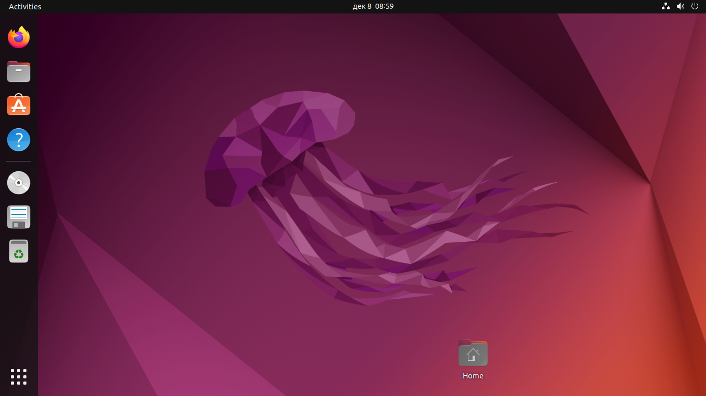
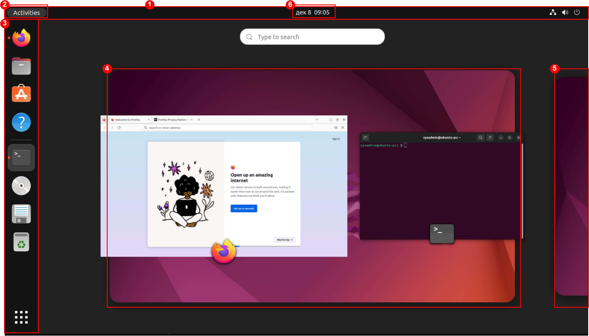
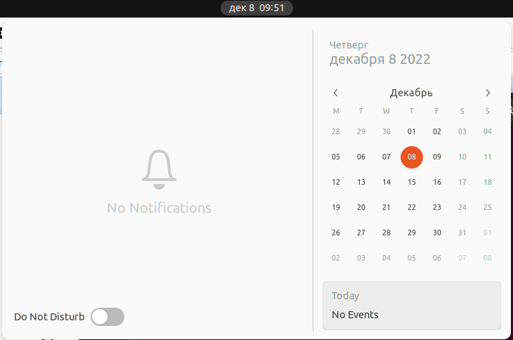

## Цели

После завершения этого раздела вы сможете войти в систему Linux, используя среду рабочего стола GNOME, чтобы выполнять команды из командной строки в программе терминала.

## Введение в среду рабочего стола gnome

Среда рабочего стола — это графический пользовательский интерфейс в системе Linux. Среда рабочего стола по умолчанию во многих дистрибутивах Linux предоставляется **GNOME**. Он предоставляет интегрированный рабочий стол для пользователей и унифицированную платформу разработки поверх графической среды, предоставляемой либо *Wayland* (по умолчанию), либо устаревшей системой *X Window*.

**GNOME Shell** предоставляет основные функции пользовательского интерфейса для среды рабочего стола GNOME. Приложение GNOME Shell легко настраивается. В некоторых дистрибутивах внешний вид оболочки GNOME по умолчанию соответствует теме «Стандартная», которая используется в этом разделе. В других, более ранних дистрибутивах по умолчанию использовалась альтернативная тема под названием «Классическая», которая по внешнему виду была ближе к старым версиям GNOME. Любую тему можно выбрать постоянно при входе в систему, щелкнув значок шестеренки рядом с кнопкой «Войти», которая доступна после выбора учетной записи, но до ввода пароля.  

  

При первом входе в систему в качестве нового пользователя запускается программа начальной настройки, помогающая настроить основные параметры учетной записи. После этого на экране запустится «Начало работы с GNOME». Этот экран содержит видеоролики и документацию, помогающие новым пользователям ориентироваться в среде GNOME. Вы можете быстро запустить справку GNOME, нажав кнопку «Действия» в левой части верхней панели и в тире, который появляется в левой части экрана, щелкнув значок спасательного круга, чтобы запустить его.

## Элементы оболочки GNOME

Элементы оболочки GNOME включают следующие части, как показано на этом снимке экрана оболочки GNOME в режиме обзора активности:

* **Верхняя панель (1)**: панель, которая проходит вдоль верхней части экрана. Она отображается в обзоре действий и в рабочих пространствах. На верхней панели находится кнопка «Действия» и элементы управления громкостью, работой в сети, доступом к календарю и переключением между методами ввода с клавиатуры (если настроено более одного). Системное меню в правом верхнем углу верхней панели позволяет управлять яркостью экрана, а также включать и выключать сетевые подключения. В подменю для имени пользователя находятся опции для настройки параметров учетной записи и выхода из системы. Системное меню также предлагает кнопки для открытия окна настроек, блокировки экрана или выключения системы.
* **Обзор активности (2)**: Это специальный режим, который помогает пользователю организовывать окна и запускать приложения. Обзор действий можно открыть, нажав кнопку «Действия» в верхнем левом углу верхней панели или нажав клавишу **Super**. Клавиша Super (иногда называемая клавишей Windows или клавишей Command) находится в левом нижнем углу клавиатуры IBM PC 104/105 или Apple. Три основные области обзора действий — это панель Dash в левой части экрана, обзор окон в центре экрана и селектор рабочей области в правой части экрана. Обзор «Действия» можно закрыть снова нажав кнопку «Действия» на верхней панели или нажав *Super* или *Esc*.
* **Dash (3)**: Это настраиваемый список значков любимых приложений пользователя, приложений, которые в данный момент запущены, и кнопка Grid в нижней части панели, которую можно использовать для выбора приложений. Приложения можно запустить, щелкнув один из значков или используя кнопку Grid, чтобы найти менее часто используемое приложение. Панель Dash также иногда называют доком.
* **Обзор окон (4)**: Область в центре обзора действий, в которой отображаются миниатюры всех окон, активных в текущей рабочей области. Это позволяет легче выводить окна на передний план в загроможденном рабочем пространстве или перемещать их в другое рабочее пространство.
* **Селектор рабочей области (5)**: Область справа от обзора действий, в которой отображаются эскизы всех активных рабочих областей и где можно выбирать рабочие области и перемещать окна из одной рабочей области в другую.
* **Панель сообщений (6)**: панель сообщений позволяет просматривать уведомления, отправленные приложениями или системными компонентами в GNOME. Если приходит уведомление, обычно уведомление сначала ненадолго появляется в виде одной строки в верхней части экрана, а в середине верхней панели рядом с часами появляется постоянный индикатор, информирующий пользователя о недавно полученных уведомлениях. Панель сообщений можно открыть для просмотра этих уведомлений, щелкнув часы на верхней панели или нажав Super + M. Панель сообщений можно закрыть, щелкнув часы на верхней панели или снова нажав *Esc* или *Super+M*.

Вы можете просматривать и редактировать сочетания клавиш GNOME, используемые вашей учетной записью. Откройте системное меню в правой части верхней панели. Нажмите кнопку «Настройки» в нижней части меню слева. В открывшемся окне приложения выберите Устройства → Клавиатура на левой панели. На правой панели отобразятся текущие настройки горячих клавиш.

Примечание

Некоторые сочетания клавиш, такие как функциональные клавиши или клавиша Super, могут быть затруднены при отправке на виртуальную машину. Это связано с тем, что специальные нажатия клавиш, используемые этими сочетаниями клавиш, могут быть перехвачены вашей локальной операционной системой или приложением, которое вы используете для доступа к графическому рабочему столу вашей виртуальной машины.

Важно

В текущих виртуальных и самостоятельных учебных средах использование клавиши Super может быть немного затруднительным. Вы, вероятно, не можете просто использовать клавишу Super на клавиатуре, потому что она обычно не передается виртуальной машине в среде класса вашим веб-браузером.

## Рабочие пространства

Рабочие пространства — это отдельные экраны рабочего стола с разными окнами приложений. Их можно использовать для организации рабочей среды путем группировки открытых окон приложений по задачам. Например, окна, используемые для выполнения определенных действий по обслуживанию системы (таких как настройка нового удаленного сервера), могут быть сгруппированы в одной рабочей области, а электронная почта и другие коммуникационные приложения могут быть сгруппированы в другой рабочей области. 

Существует два простых способа переключения между рабочими пространствами. Один из способов, возможно, самый быстрый, — нажать `Ctrl+Alt+Стрелка вверх` или `Ctrl+Alt+Стрелка вниз` для последовательного переключения между рабочими пространствами. Второй — переключиться на обзор действий и щелкнуть нужную рабочую область.

Преимущество использования обзора действий заключается в том, что окна можно щелкать и перетаскивать между рабочими пространствами с помощью селектора рабочего пространства в правой части экрана и обзора окон в центре экрана.

Важно

Как и в случае с Super, в современных средах виртуального обучения и самостоятельного обучения комбинации клавиш **Ctrl+Alt** могут не передаваться виртуальной машине в  виртуальной среде вашим веб-браузером.

## Запуск терминала

Чтобы открыть командную оболочку в GNOME, запустите приложение графического терминала, например GNOME Terminal. Сделать это можно несколькими способами. Два наиболее часто используемых метода приведены ниже.

* На экране обзора действий выберите Terminal на панели инструментов (в области избранного либо поиском с помощью кнопки сетки (в группе Utilities) или поля поиска в верхней части обзора окон).
* Нажмите клавиши **Alt+F2**, чтобы открыть окно Enter a Command и введите gnome-terminal.

При открытии окна терминала для пользователя, запустившего программу графического терминала, появляется командная оболочка. Командная оболочка и строка заголовка окна терминала показывают имя текущего пользователя, имя хоста и рабочий каталог.

### Блокировка экрана и выход

Для блокировки экрана и выхода из системы можно использовать системное меню в правом углу верхней панели.

Чтобы заблокировать экран, в системном меню в правом верхнем углу нажмите кнопку замка в нижней части меню или нажмите **Super+L** (по аналогии с **Windows+L**). Кроме того, экран блокируется, если графический сеанс бездействует несколько минут.

Появится шторка экрана блокировки, показывающая системное время и имя пользователя, вошедшего в систему. Для разблокировки экрана нажмите Enter или Space, чтобы поднять шторку, а затем введите пароль пользователя на экране блокировки.

Чтобы выйти и завершить текущий графический сеанс, выберите системное меню в правой части верхней панели и нажмите (Пользователь) → Log Out. Появится окно с параметрами Cancel для отмены и Log Out для выхода из системы.

# Выключение и перезагрузка системы
Чтобы выключить систему, в системном меню в правом верхнем углу нажмите кнопку питания в нижней части меню или нажмите **Ctrl+Alt+Del**. В открывшемся диалоговом окне можно выбрать Power Off для выключения, Restart для перезагрузки машины или Cancel для отмены операции. Если ничего не выбрать, система автоматически выключится через 60 секунд.