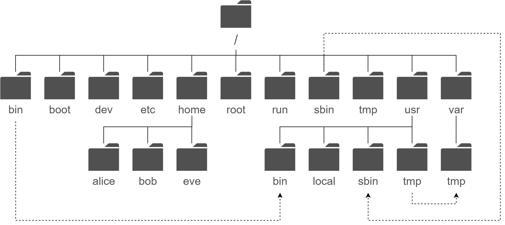

## Цели

После завершения этого раздела вы сможете описать, каким образом Linux организует файлы, а также назначения различных каталогов в иерархии файловой системы.

## Иерархия файловой системы

Все файлы в системе Linux хранятся в файловых системах, которые организованы в единое инвертированное дерево каталогов, известное как иерархия файловой системы. Дерево является инвертированным, поскольку его корень находится на вершине иерархии, а ветви из каталогов и подкаталогов простираются ниже корня.

Каталог **/** ― это корневой каталог на вершине иерархии файловой системы. Символ / также используется в качестве разделителя каталогов в именах файлов. Например, если etc является подкаталогом каталога **/**, указать этот каталог можно так: **/etc**. Аналогично, если каталог **/etc** содержит файл с именем issue, указать этот файл можно так: **/etc/issue**.

Подкаталоги в **/** используются для стандартизации и организации файлов по типу и назначению. Это упрощает поиск файлов. Например, подкаталог **/boot** в корневом каталоге используется для хранения файлов, необходимых для загрузки системы.

Примечание

Описать содержимое каталогов файловой системы помогают следующие термины:

* Статическое содержимое остается неизмененным, пока не будет явным образом отредактировано или настроено.
* Динамическое или переменное содержимое может изменяться и дополняться активными процессами.
* Постоянное содержимое (например, параметры конфигурации) сохраняется после перезагрузки.
* Содержимое среды выполнения — это содержимое конкретных процессов и систем, которое удаляется при перезагрузке.

В следующей таблице указаны некоторые из наиболее важных каталогов системы по имени и назначению.

**Таблица 3.1.1** Важные каталоги Red Hat Enterprise Linux

| Расположение |	Назначение |
|---|---|
| /usr |	Установленное программное обеспечение, общие библиотеки, включаемые файлы, а также данные программ, доступные только для чтения. К важным подкаталогам относятся следующие: **/usr/bin:** пользовательские команды; **/usr/sbin**: команды для системного администрирования; **/usr/local**: локально установленное программное обеспечение. |
| /etc |	Файлы конфигурации для данной системы. |
| /var |	Переменные данные для данной системы, которые должны сохраняться между перезагрузками системы. Файлы, которые динамически изменяются (например, базы данных, каталоги кэша, log-файлы, отправленные в очередь печати документы, содержимое веб-сайта), находятся в каталоге /var. |
| /run |	Данные среды выполнения для процессов, запущенных с момента последней загрузки системы. Помимо прочего, сюда входят файлы с идентификаторами процессов и файлы блокировки. Содержимое этого каталога повторно создается при перезагрузке системы. Этот каталог объединяет **/var/run** и **/var/lock** из более ранних версий Linux. |
| /home |	Домашние каталоги, где обычные пользователи хранят личные данные и файлы конфигурации. |
| /root |	Домашний каталог для привилегированного пользователя с правами администратора (*root*). |
| /tmp |	Пространство для временных файлов, доступное для записи любым пользователям. Файлы, к которым не было обращения и которые не были изменены в течение последних 10 дней, удаляются из этого каталога автоматически. Существует еще один временный каталог ― **/var/tmp**. В нем автоматически удаляются файлы, к которым не было обращения и которые не были изменены в течение последних 30 дней. |
| /boot |	Файлы, необходимые для запуска процесса загрузки. |
| /dev |	Содержит специальные файлы устройств, которые используются системой для доступа к оборудованию. |

Важно

В современных дистрибутивах Linux четыре каталога в / являются символьными ссылками на соответствующие каталоги в /usr и, следовательно имеют идентичное содержимое:

* /bin -> /usr/bin
* /sbin -> /usr/sbin
* /lib -> /usr/lib
* /lib64 -> /usr/lib64

В более ранних дистрибутивах это были отдельные каталоги, содержащие разные наборы файлов.

