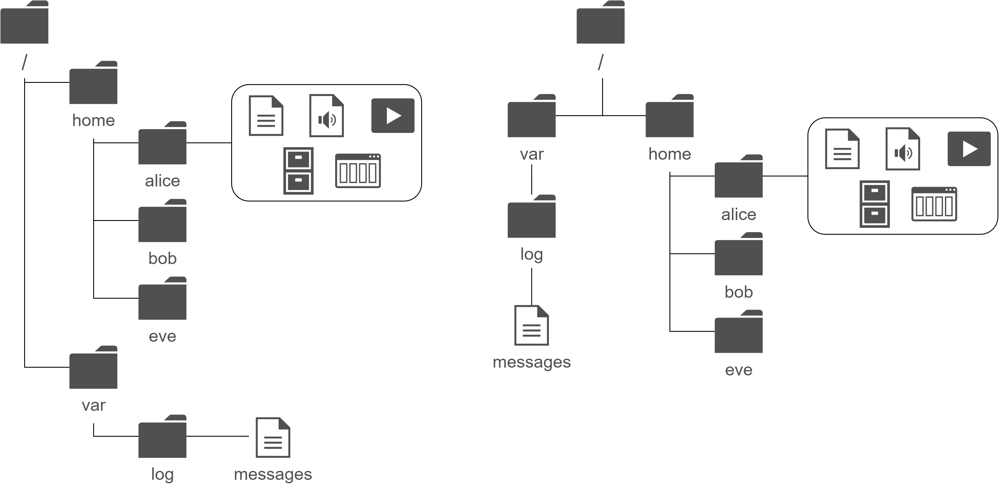

## Цели

После завершения этого раздела вы сможете указать расположение файлов относительно текущего рабочего каталога и по абсолютному расположению, определить и изменить рабочий каталог, а также отобразить содержимое каталогов.

## Абсолютные и относительные пути

Обычное представление файлового браузера (слева) эквивалентно представлению сверху вниз (справа)



Путь к файлу или каталогу определяет его уникальное расположение в файловой системе. На пути к целевому расположению находятся один или несколько именованных подкаталогов, разделенных косой чертой (/). Каталоги, также называемые папками, содержат другие файлы и подкаталоги. На них можно ссылаться так же, как на файлы.

<details>
<summary>Важно</summary>
В именах файлов Linux можно использовать пробелы. Однако пробелы также используются командной оболочкой для разделения опций и аргументов в командной строке. Если вы введете команду, содержащую имя файла с пробелом, оболочка может неправильно интерпретировать команду и предположить, что вы хотите начать новое имя файла или другой аргумент после пробела.
Во избежание такой ситуации заключайте имена файлов в кавычки. Однако проще всего вообще не использовать пробелы в именах файлов, если в них нет особой необходимости.
</details>

### Абсолютные пути

**Абсолютный путь** — это полностью определенное имя, указывающее точное расположение файлов в иерархии файловой системы. Он начинается с корневого каталога (**/**) и указывает каждый подкаталог, через который необходимо пройти, чтобы добраться до конкретного файла. У каждого файла в файловой системе есть уникальный абсолютный путь, который можно узнать по простому правилу: имя пути с косой чертой (**/**) в начале — это абсолютный путь. Например, абсолютный путь для log-файла системных сообщений — **/var/log/messages**. Абсолютные пути могут быть довольно длинными, поэтому расположение файлов можно также указывать относительно текущего рабочего каталога для командной оболочки.

### Текущий рабочий каталог и относительные пути

Когда пользователь входит в систему и открывает командное окно, начальным расположением, как правило, бывает домашний каталог пользователя. У системных процессов также есть начальный каталог. Пользователи и процессы переходят в другие каталоги по мере необходимости. Термины **рабочий каталог** и **текущий рабочий каталог** означают их текущее расположение.

Как и *абсолютный путь*, **относительный путь** определяет уникальный файл с указанием только пути, необходимого для достижения файла из рабочего каталога. Распознать относительный путь так же просто: имя пути, не имеющее косой черты в начале ― это относительный путь. Пользователь в каталоге **/var** может ссылаться на log-файл сообщений, используя относительный путь: **log/messages**.

Файловые системы Linux, в том числе ext4, XFS, GFS2 и GlusterFS, учитывают регистр символов. Создание **FileCase.txt** и **filecase.txt** в одном каталоге приведет к созданию двух уникальных файлов.

Файловые системы, отличные от Linux, могут работать по-другому. Например, VFAT, Microsoft NTFS и Apple HFS+ сохраняют регистр в именах. Хотя эти файловые системы не учитывают регистр, они отображают имена файлов с исходным регистром символов, использовавшимся при создании файлов. Если вы попытаетесь создать файлы из предыдущего примера в файловой системе VFAT, оба имени будут указывать на один и тот же файл, а не на два разных файла.

## Навигация по путям

Команда `pwd` отображает полный путь к текущему рабочему каталогу для командной оболочки. Это поможет вам определить синтаксис для доступа к файлам с использованием относительных путей. Команда `ls` отображает содержимое указанного каталога или, если каталог не задан, текущего рабочего каталога.

```shell
[user@host ~]$ pwd
/home/user
[user@host ~]$ ls
Desktop  Documents  Downloads  Music  Pictures  Public  Templates  Videos
[user@host ~]$
```

Используйте команду `cd`, чтобы изменить текущий рабочий каталог командной оболочки. Если не указать аргументы для команды, она перейдет в домашний каталог.

В следующем примере с командой `cd` используются абсолютный и относительный пути для изменения текущего рабочего каталога командной оболочки.

```shell
[user@host ~]$ pwd
/home/user
[user@host ~]$ cd Videos
[user@host Videos]$ pwd
/home/user/Videos
[user@host Videos]$ cd /home/user/Documents
[user@host Documents]$ pwd
/home/user/Documents
[user@host Documents]$ cd
[user@host ~]$ pwd
/home/user
[user@host ~]$
```

Как видно из предыдущего примера, в стандартном приглашении командной оболочки также отображается последний компонент абсолютного пути к текущему рабочему каталогу. Например, в случае **/home/user/Videos** отображается только **Videos**. Если текущий рабочий каталог ― это домашний каталог, в приглашении отображается тильда (**~**).

Команда `touch` обычно обновляет метку времени файла до текущей даты и времени, не внося других изменений. Это полезно для создания пустых файлов, которые можно использовать для практической работы, так как указание имени несуществующего файла приводит к его созданию. В следующем примере команда `touch` создает примеры файлов в подкаталогах **Documents** и **Videos**.

```shell
[user@host ~]$ touch Videos/blockbuster1.ogg
[user@host ~]$ touch Videos/blockbuster2.ogg
[user@host ~]$ touch Documents/thesis_chapter1.odf
[user@host ~]$ touch Documents/thesis_chapter2.odf
[user@host ~]$
```

У команды `ls` есть несколько опций для отображения атрибутов файлов. Самые распространенные и полезные — это `-l` (формат длинного списка), `-a` (все файлы, включая скрытые) и `-R` (рекурсия для включения содержимого всех подкаталогов).

```shell
[user@host ~]$ ls -l
total 15
drwxr-xr-x.  2 user user 4096 Feb  7 14:02 Desktop
drwxr-xr-x.  2 user user 4096 Jan  9 15:00 Documents
drwxr-xr-x.  3 user user 4096 Jan  9 15:00 Downloads
drwxr-xr-x.  2 user user 4096 Jan  9 15:00 Music
drwxr-xr-x.  2 user user 4096 Jan  9 15:00 Pictures
drwxr-xr-x.  2 user user 4096 Jan  9 15:00 Public
drwxr-xr-x.  2 user user 4096 Jan  9 15:00 Templates
drwxr-xr-x.  2 user user 4096 Jan  9 15:00 Videos
[user@host ~]$ ls -la
total 15
drwx------. 16 user user   4096 Feb  8 16:15 .
drwxr-xr-x.  6 root root   4096 Feb  8 16:13 ..
-rw-------.  1 user user  22664 Feb  8 00:37 .bash_history
-rw-r--r--.  1 user user     18 Jul  9  2013 .bash_logout
-rw-r--r--.  1 user user    176 Jul  9  2013 .bash_profile
-rw-r--r--.  1 user user    124 Jul  9  2013 .bashrc
drwxr-xr-x.  4 user user   4096 Jan 20 14:02 .cache
drwxr-xr-x.  8 user user   4096 Feb  5 11:45 .config
drwxr-xr-x.  2 user user   4096 Feb  7 14:02 Desktop
drwxr-xr-x.  2 user user   4096 Jan  9 15:00 Documents
drwxr-xr-x.  3 user user   4096 Jan 25 20:48 Downloads
drwxr-xr-x. 11 user user   4096 Feb  6 13:07 .gnome2
drwx------.  2 user user   4096 Jan 20 14:02 .gnome2_private
-rw-------.  1 user user  15190 Feb  8 09:49 .ICEauthority
drwxr-xr-x.  3 user user   4096 Jan  9 15:00 .local
drwxr-xr-x.  2 user user   4096 Jan  9 15:00 Music
drwxr-xr-x.  2 user user   4096 Jan  9 15:00 Pictures
drwxr-xr-x.  2 user user   4096 Jan  9 15:00 Public
drwxr-xr-x.  2 user user   4096 Jan  9 15:00 Templates
drwxr-xr-x.  2 user user   4096 Jan  9 15:00 Videos
[user@host ~]$
```

Два специальных каталога в верхней части списка указывают на текущий (`.`) и родительский каталог (`..`). Эти специальные каталоги существуют в каждом каталоге в системе. Вы поймете, насколько они полезны, когда начнете использовать команды управления файлами.

<details>
<summary>Важно</summary>

Имена файлов, начинающиеся с точки (`.`), обозначают скрытые файлы. Обычно вы их не видите при использовании `ls` и других команд. Это не механизм безопасности. Благодаря скрытым файлам домашние каталоги пользователей не загромождены файлами конфигурации. Многие команды обрабатывают скрытые файлы только с помощью определенных опций командной строки, что не позволяет случайно скопировать конфигурацию одного пользователя в другие каталоги или для других пользователей.

Чтобы защитить содержимое файла от несанкционированного просмотра, необходимо применять разрешения файла.
</details>

```shell
[user@host ~]$ ls -R
.:
Desktop  Documents  Downloads  Music  Pictures  Public  Templates  Videos

./Desktop:

./Documents:
thesis_chapter1.odf  thesis_chapter2.odf

./Downloads:

./Music:

./Pictures:

./Public:

./Templates:

./Videos:
blockbuster1.ogg  blockbuster2.ogg
[user@host ~]$
```

У команды `cd` много опций. Некоторые из них настолько полезны, что их следует изучить в первую очередь и применять регулярно. Команда `cd` - меняет каталог на тот, в котором пользователь находился до перехода в текущий каталог. Следующий пример иллюстрирует это поведение. В нем чередуются два каталога, что полезно при обработке ряда похожих задач.

```shell
[user@host ~]$ cd Videos
[user@host Videos]$ pwd
/home/user/Videos
[user@host Videos]$ cd /home/user/Documents
[user@host Documents]$ pwd
/home/user/Documents
[user@host Documents]$ cd -
[user@host Videos]$ pwd
/home/user/Videos
[user@host Videos]$ cd -
[user@host Documents]$ pwd
/home/user/Documents
[user@host Documents]$ cd -
[user@host Videos]$ pwd
/home/user/Videos
[user@host Videos]$ cd
[user@host ~]$
```

Команда `cd ..` использует скрытый каталог `..` для перемещения на уровень вверх в родительский каталог, при этом знать его имя не требуется. Другой скрытый каталог (`.`) указывает текущий каталог в командах, для которых текущее расположение — это аргумент исходного или целевого расположения, что устраняет необходимость вводить абсолютный путь каталога.

```shell
[user@host Videos]$ pwd
/home/user/Videos
[user@host Videos]$ cd .
[user@host Videos]$ pwd
/home/user/Videos
[user@host Videos]$ cd ..
[user@host ~]$ pwd
/home/user
[user@host ~]$ cd ..
[user@host home]$ pwd
/home
[user@host home]$ cd ..
[user@host /]$ pwd
/
[user@host /]$ cd
[user@host ~]$ pwd
/home/user
```