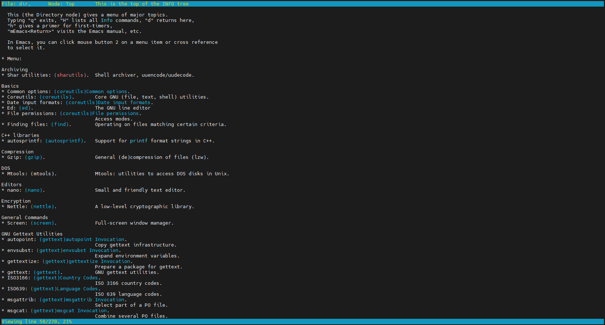

## Цели

После завершения этого раздела учащиеся смогут найти информацию в локальной документации GNU Info.

## Знакомство с GNU Info

Man-страницы имеют формат, удобный для изучения команд, но менее подходящий для использования в качестве общей документации. Для таких документов в рамках проекта GNU разработана другая онлайн-система документации, которая называется GNU Info. Документы Info — важный ресурс в системе Red Hat Enterprise Linux, так как многие базовые компоненты и утилиты, такие как пакет coreutils и стандартные библиотеки glibc, разработаны в рамках проекта GNU или используют систему документации Info.

<details>
<summary>Важно</summary>

Вам может быть интересно, зачем нужны две локальные системы документации (man-страницы и документы *Info*). Одна из причин ― практическое удобство. Другая причина ― то, каким образом система Linux и ее приложения разрабатывались разными сообществами разработчиков открытого исходного кода в течение многих лет.

Man-страницы более формализованы. Обычно они описывают определенную команду или функцию из программного пакета и структурированы в виде отдельных текстовых файлов. Документы *Info* обычно охватывают конкретные программные пакеты целиком, содержат больше практических примеров использования программного обеспечения и структурированы как гипертекстовые документы.

Чтобы использовать предоставляемую информацию с максимальной пользой, необходимо хорошо разбираться в обеих системах.
</details>

### Чтение документации Info

Чтобы запустить средство просмотра документов *Info*, используйте команду `pinfo`. *pinfo* открывается в верхнем каталоге.



Документация Info является комплексной и содержит гиперссылки. Страницы Info можно просматривать в различных форматах. В отличие от них, man-страницы оптимизированы для вывода на печать. Формат Info более гибкий по сравнению с man-страницами и позволяет подробно рассматривать сложные команды и концепции. Как и *man-страницы*, узлы *Info* вызываются из командной строки с помощью команды `pinfo`.

Типичная man-страница содержит небольшой объем содержимого, посвященного одной конкретной теме, команде, утилите или файлу. Info ― это комплексный документ. В Info реализованы следующие улучшения:

* единый документ для масштабной системы, содержащий всю необходимую информацию;
* гиперссылки;
* полный индекс, удобный для просмотра;
* полнотекстовый поиск по всему документу.

Для некоторых команд и утилит предусмотрены и *man-страницы*, и документация *Info*. Как правило, документация *Info* является более полной. Сравните различия в документации *tar* при использовании команд `man` и `pinfo`.

```shell
[user@host ~]$ man tar
[user@host ~]$ pinfo tar
```

Средство чтения *pinfo* более развито по сравнению с оригинальной командой *info*. Чтобы просмотреть конкретную тему, используйте команду `pinfo topic`. Команда `pinfo` без аргумента открывает верхний каталог. Новая документация становится доступной в *pinfo* при установке соответствующих программных пакетов.

<details>
<summary>Примечание</summary>

Если в системе нет темы Info по вашему запросу, Info найдет и откроет подходящую man-страницу.
</details>

## Сравнение навигации по GNU Info и man-страницам

Клавиши навигации в командах `pinfo` и `man` немного отличаются. В следующей таблице сравниваются клавиши навигации для этих двух команд.

**Таблица 4.2.1.** Сравнение клавиш для `pinfo` и `man`

| Навигация | pinfo | man |
| --- | --- | --- |
| Прокрутка вперед (вниз) на один экран | Страница вниз или пробел | Страница вниз или пробел |
| Прокрутка назад (вверх) на один экран | Страница вверх или b | Страница вверх или b |
| Отображение каталога тем | d   | -   |
| Прокрутка вперед (вниз) на половину экрана | -   | d   |
| Отображение родительского узла темы | u   | -   |
| Отображение верхнего уровня темы | HOME | g   |
| Прокрутка назад (вверх) на половину экрана | -   | u   |
| Прокрутка вперед (вниз) к следующей гиперссылке | Стрелка вниз | -   |
| Открытие темы в позиции курсора | Введите | -   |
| Прокрутка вперед (вниз) на одну строку | -   | Стрелка вниз или Enter |
| Прокрутка назад (вверх) к предыдущей гиперссылке | Стрелка верх | -   |
| Прокрутка назад (вверх) на одну строку | -   | Стрелка верх |
| Поиск по шаблону | **/**строка | **/**строка |
| Отображение следующего узла (главы) в теме | n   | -   |
| Повтор предыдущего поиска вперед (вниз) | **/**, затем **Enter** | n   |
| Отображение предыдущего узла (главы) в теме | p   | -   |
| Повтор предыдущего поиска назад (вверх) | -   | N   |
| Выход из программы | q   | q   |