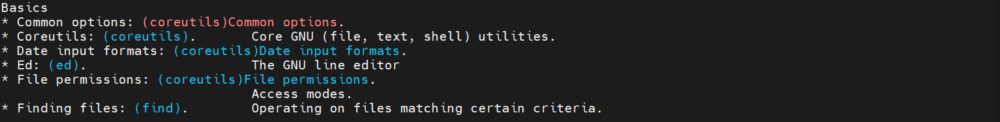
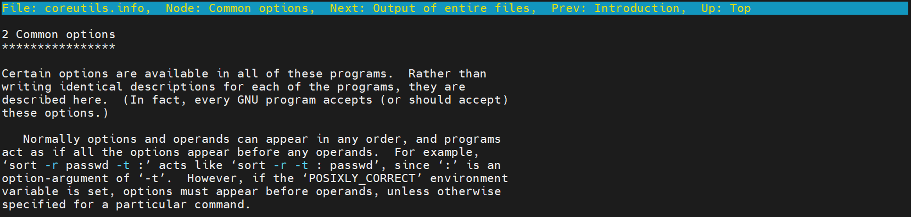
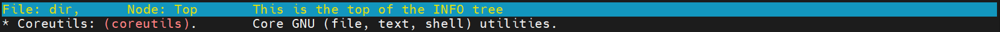

## Цель

Вы сможете перемещаться по документации GNU Info с помощью утилит командной строки.


## Задачи

В этом упражнении вы будете искать информацию, хранящуюся в документах GNU Info, перемещаясь по этим документам с помощью утилит командной строки.

Войдите на **workstation** как пользователь *student* с паролем *student*.

На workstation выполните команду `lab help-info start`.

```
[student@workstation ~]$ lab help-info start
```

1.	На **workstation** выполните команду `pinfo` без аргументов.

```
[student@workstation ~]$ pinfo
```

2.	Перейдите к теме **Common options**.

    2.1.	Нажимайте стрелку вверх или стрелку вниз, пока не будет выделена тема **(coreutils) Common options**.

    

3.	Нажмите Enter, чтобы просмотреть эту тему.

    

4.	Просмотрите эту тему Info. Узнайте, можно ли сократить длинные опции.

    Используйте клавиши Страница вверх и Страница вниз для навигации по теме. Да, многие программы позволяют сокращать длинные опции.

5.	Определите, что означают символы `--` при использовании в качестве аргумента команды.

    Символы -- указывают окончание опций команд и начало аргументов в сложных командах, где средство синтаксического анализа командной строки может не справиться с распознаванием.

6.	Не выходя из pinfo, перейдите вверх к узлу **GNU Coreutils**.

    Нажмите `u`, чтобы перейти к верхнему узлу темы.

7.	Вернитесь к теме верхнего уровня.

    Снова нажмите `u`. Обратите внимание, что переход вверх из верхней части узла темы возвращает вас в каталог тем. Нажатие `d` на любом уровне и в любой теме также перемещает вас напрямую в каталог тем.

8.	Выполните поиск по шаблону **Core GNU** и выберите эту тему.

    Нажмите / и введите шаблон поиска `Core GNU`. Пока выделена тема, нажмите Enter.

    

9.	В меню сверху найдите и выберите **Output of entire files**, нажав `n`. Просмотрите тему.

    С помощью клавиши **Enter** выберите **cat invocation**. С помощью клавиш со стрелками просмотрите тему.

10.	Поднимитесь на два уровня вверх, чтобы вернуться в **GNU Coreutils**. Перейдите к **Summarizing files**.

    Нажмите **Enter**, чтобы выбрать тему, а затем просмотрите ее.

11.	Нажмите `q`, чтобы выйти из pinfo.

12.	Снова используйте команду `pinfo`, указав coreutils как тему назначения в командной строке.

    ```
    [student@workstation ~]$ pinfo coreutils
    ```

13.	Выберите тему **Disk usage**.

    Нажмите стрелку вниз, чтобы выделить **Disk usage**, а затем нажмите Enter, чтобы выбрать эту тему.

14.	Прочитайте подтемы **df invocation** и **du invocation**.

    С помощью клавиш со стрелками выделите тему, просматривайте текст с помощью клавиш Страница вверх и Страница вниз, а затем нажмите `u`, чтобы перейти на один уровень вверх. По окончании нажмите `q`, чтобы выйти.

## Конец

На **workstation** запустите сценарий `lab help-info finish`, чтобы закончить упражнение.

```
[student@workstation ~]$ lab help-info finish
```

Упражнение завершено.
