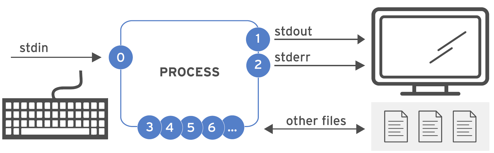
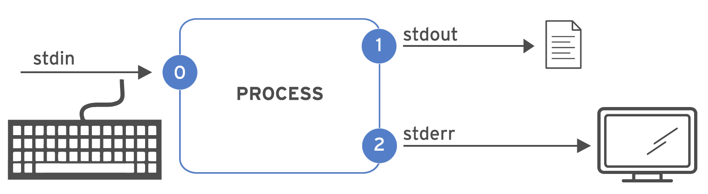
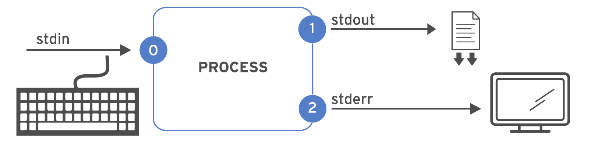
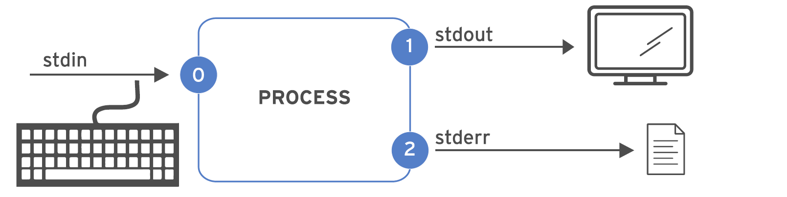
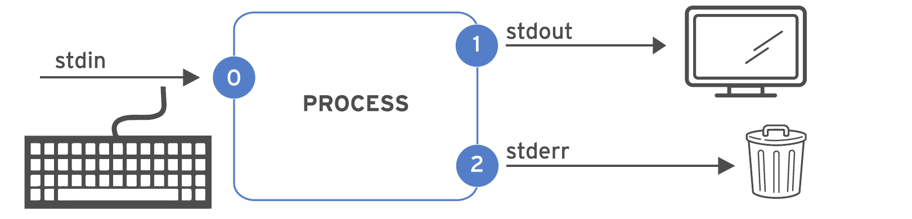
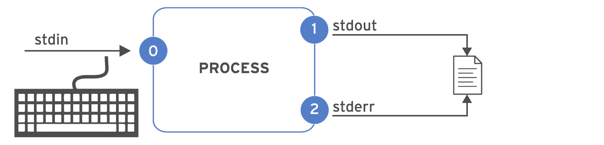
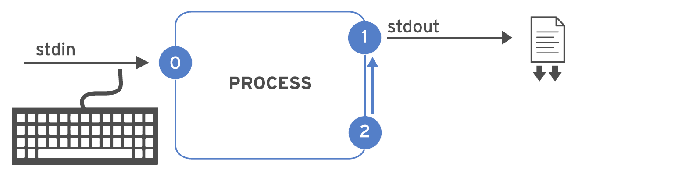
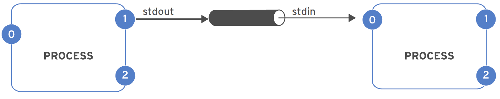
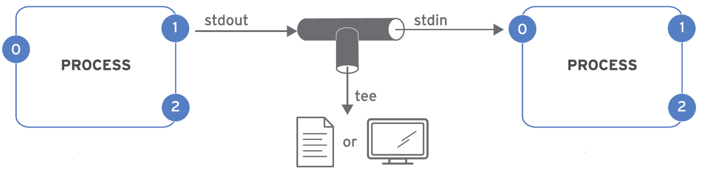

## Цель

После завершения этого раздела вы сможете сохранить вывод или ошибки команды в файл, используя перенаправление командной оболочки, а также обработать вывод команды через несколько программ командной строки с использованием конвейеров.

## Стандартный поток ввода, стандартный поток вывода и стандартный поток ошибок

Работающая программа или процесс должны откуда-то считывать информацию и куда-то записывать вывод. Команда, выполняемая из командной оболочки, как правило, считывает входные данные с клавиатуры и направляет вывод в окно терминала.

Процесс использует пронумерованные каналы, называемые дескрипторами файлов, для получения входных данных и отправки вывода. Все процессы имеют по крайней мере три дескриптора файлов: 

* Стандартный поток ввода (канал 0) считывает входные данные с клавиатуры.
* Стандартный поток вывода (канал 1) отправляет нормальные выходные данные на терминал.
* Стандартный поток ошибок (канал 2) отправляет сообщения об ошибках на терминал. 

Если программа открывает отдельные подключения к другим файлам, то может использовать дескрипторы файлов с большими номерами.



**Таблица 5.1.1.** Каналы (дескрипторы файлов)

| Номер | Название канала | Описание | Подключение по умолчанию | Использование |
| --- | --- | --- | --- | --- |
| 0   | stdin | Стандартный поток ввода | Клавиатура | Только чтение |
| 1   | stdout | Стандартный поток вывода | Терминал | Только запись |
| 2   | stderr | Стандартный поток ошибок | Терминал | Только запись |
| 3+  | _имя_ _файла_ | Другие файлы | нет | Чтение и/или запись |

## Перенаправление вывода в файл

Перенаправление ввода-вывода изменяет то, каким образом процесс получает входные данные или отправляет выходные данные. Вместо получения входных данных с клавиатуры или отправки вывода и ошибок на терминал процесс считывает данные из файлов или записывает их в файлы. Перенаправление позволяет сохранять в файле сообщения, которые обычно отправляются в окно терминала. Кроме того, с помощью перенаправления можно отменить отображение на терминале или сохранение вывода и ошибок.

Перенаправление **stdout** блокирует передачу выходных данных процесса на терминал. Как видно в следующей таблице, перенаправление *только* **stdout** не влияет на вывод сообщений об ошибках **stderr** на терминал. Если файл не существует, он будет создан. Если файл уже существует, а перенаправление не предполагает дописывание в файл, содержимое файла будет перезаписано.
Если необходимо игнорировать сообщения, можно использовать особый файл **/dev/null**. Он удаляет выходные данные канала, перенаправляемые в него, без каких-либо уведомлений и всегда пуст.

**Таблица 5.1.2.** Операторы перенаправления вывода

| **Использование** | **Объяснение** | **Визуальная** **подсказка** |
| --- | --- | --- |
| > _file_ | Перенаправить stdout для перезаписи файла |     |
| >> _file_ | Перенаправить stdout для дописывания в файл |     |
| 2> _file_ | Перенаправить stderr для перезаписи файла |     |
| 2> /dev/null | Отменить сообщения об ошибках stderr путем перенаправления на /dev/null |     |
| > _file_  2>&1 | Перенаправить stdout и stderr для перезаписи того же файла |     |
| &> _file_, >> _file_  2>&1 | Перенаправить stdout и stderr для дописывания в тот же файл |     |

<details>
<summary>Важно</summary>

Порядок операций перенаправления очень важен. Следующая последовательность перенаправляет стандартный поток вывода в file, а затем перенаправляет стандартный поток ошибок в то же самое место, что и стандартный поток вывода (file).

```
 > file 2>&1 
```

Однако следующая последовательность выполняет перенаправление в обратном порядке. Она перенаправляет стандартный поток ошибок в место по умолчанию для стандартного потока вывода (в окно терминала, поэтому никаких изменений), а затем перенаправляет только стандартный поток вывода в file.

```
 2>&1 > file 
```

Из-за этого некоторые пользователи предпочитают использовать операторы слияния перенаправления.


* &>file	вместо	>file 2>&1
* &>>file	вместо	>>file 2>&1 (в Bash 4 и более поздних версиях)
		
Однако другие системные администраторы и программисты, которые также используют другие командные оболочки, связанные с bash («Bourne-совместимые оболочки»), для команд сценариев, думают, что новых операторов слияния перенаправления следует избегать, так как они не стандартизированы и не реализованы в некоторых оболочках, а также имеют другие ограничения.
</details>

### Примеры перенаправления вывода

С помощью перенаправления упрощаются многие типовые задачи администрирования. Используйте предыдущую таблицу для справки при рассмотрении следующих примеров:

* Сохраните метку времени для последующего использования.

    ```
    [user@host ~]$ date > /tmp/saved-timestamp
    ```

* Скопируйте последние 100 строк из log-файла в другой файл.

    ```
    [user@host ~]$ tail -n 100 /var/log/dmesg > /tmp/last-100-boot-messages
    ```

* Объедините четыре файла в один.

    ```
    [user@host ~]$ cat file1 file2 file3 file4 > /tmp/all-four-in-one
    ```

* Выведите список имен скрытых и обычных файлов, находящихся в домашнем каталоге, в файл.

    ```
    [user@host ~]$ ls -a > /tmp/my-file-names
    ```

* Добавьте вывод в существующий файл.

    ```
    [user@host ~]$ echo "new line of information" >> /tmp/many-lines-of-information
    [user@host ~]$ diff previous-file current-file >> /tmp/tracking-changes-made
    ```

* Следующие несколько команд создают сообщения об ошибках, поскольку некоторые системные каталоги недоступны для обычных пользователей. Посмотрите, как осуществляется перенаправление сообщений об ошибках. Перенаправьте ошибки в файл, просматривая нормальный вывод команды на терминале.

    ```
    [user@host ~]$ find /etc -name passwd 2> /tmp/errors
    ```

* Сохраните вывод процесса и сообщения об ошибках в отдельные файлы.

    ```
    [user@host ~]$ find /etc -name passwd > /tmp/output 2> /tmp/errors
    ```

* Игнорируйте и отбрасывайте сообщения об ошибках.

    ```
    [user@host ~]$ find /etc -name passwd > /tmp/output 2> /dev/null
    ```

* Сохраните вывод и сообщения об ошибках вместе.

    ```
    [user@host ~]$ find /etc -name passwd &> /tmp/save-both
    ```

* Добавьте вывод и сообщения об ошибках в существующий файл.

    ```
    [user@host ~]$ find /etc -name passwd >> /tmp/save-both 2>&1
    ```

## Создание конвейеров

**Конвейер** — это последовательность из одной или нескольких команд, разделенных символом вертикальной черты (`|`). Конвейер соединяет стандартный поток вывода первой команды со стандартным потоком ввода следующей команды.



Конвейеры позволяют другим процессам управлять выходными данными процесса и форматировать их, прежде чем вывести на терминал. Представьте, что данные «текут» по трубопроводу от одного процесса к другому и незначительно изменяются каждой командой, через которую они проходят.

<details>
<summary>Примечание</summary>

Конвейеры и функция перенаправления входных и выходных данных управляют стандартным потоком вывода и стандартным потоком ввода. Перенаправление отправляет стандартный поток вывода в файлы или получает стандартный поток ввода из них. Конвейеры отправляют стандартный поток вывода из одного процесса в стандартный поток ввода другого процесса.
</details>

### Примеры конвейера

В этом примере используется вывод команды `ls` и параметр `less` для его отображения на терминале по одному экрану за раз.

```
[user@host ~]$ ls -l /usr/bin | less
```

Вывод команды `ls` передается конвейером команде `wc -l`, которая подсчитывает количество строк, полученных от `ls`, и выводит их на терминал.

```
[user@host ~]$ ls | wc -l
```

В этом конвейере команда `head` выдаст первые 10 строк вывода из `ls -t` и перенаправит конечный результат в файл.

```
[user@host ~]$ ls -t | head -n 10 > /tmp/ten-last-changed-files
```

### Конвейеры, перенаправление и команда tee

Когда перенаправление совмещается с конвейером, командная оболочка сначала выстраивает весь конвейер, а затем перенаправляет входные и выходные данные. Если использовать перенаправление вывода в середине конвейера, результат будет отправлен в файл, а не следующей команде в конвейере.

В этом примере вывод команды `ls` направляется в файл, а команда `less` ничего не выводит на терминал.

```
[user@host ~]$ ls > /tmp/saved-output | less
```

Команда `tee` преодолевает это ограничение. В конвейере команда `tee` копирует свой стандартный поток ввода в стандартный поток вывода, а также перенаправляет свой стандартный поток вывода в файлы с названиями, как в аргументах команды. Если представить данные как воду, текущую по трубопроводу, то команду `tee` можно представить как т-ройник в трубе, который направляет выходные данные в двух направлениях.



### Примеры конвейера, в которых используется команда tee

В этом примере вывод команды `ls` перенаправляется в файл и передается команде `less` для отображения на терминале по одному экрану за раз.

```
[user@host ~]$ ls -l | tee /tmp/saved-output | less
```

Если tee используется в конце конвейера, окончательный вывод команды можно одновременно сохранить и вывести на терминал.

```
[user@host ~]$ ls -t | head -n 10 | tee /tmp/ten-last-changed-files
```

<details>
<summary>Важно</summary>

Стандартный поток ошибок может быть перенаправлен по конвейеру, но использовать для этого операторы слияния перенаправления (&> и &>>) нельзя.

Ниже приведен правильный способ перенаправления стандартного потока вывода и стандартного потока ошибок по конвейеру.

```
[user@host ~]$ find -name / passwd 2>&1 | less
```
</details>