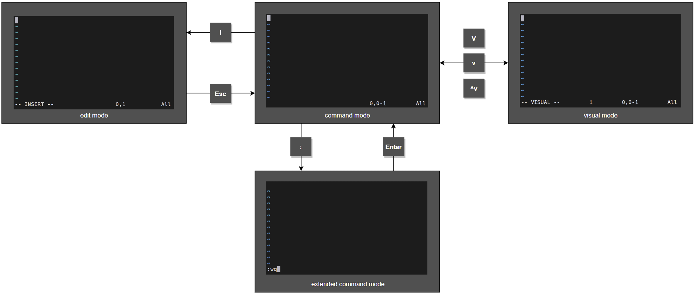

## Цель

После завершения этого раздела вы сможете создавать и редактировать текстовые файлы из командной строки, используя редактор vim.

## Редактирование файлов с помощью Vim

Основной принцип архитектуры Linux заключается в том, что информация и параметры конфигурации обычно хранятся в текстовых файлах. Эти файлы можно структурировать различными способами: в виде списков параметров, в INI-подобном формате, в виде структурированных файлов XML или YAML и т. д. Преимущество текстовых файлов в том, что их можно просматривать и редактировать с помощью любого простого текстового редактора.

**Vim** — это улучшенная версия редактора **vi**, которая распространяется с системами Linux и UNIX. Это эффективный редактор для опытных пользователей с возможностью детальной настройки. Он включает такие возможности, как разделение экрана на несколько окон, цветовое форматирование и подсветка для редактирования текста.

### Зачем нужно уметь работать с Vim?

Вы должны знать, как пользоваться хотя бы одним текстовым редактором, который можно использовать в командной оболочке, поддерживающей только текст. Так вы сможете редактировать текстовые файлы конфигурации из окна терминала или с помощью сеансов удаленного входа через ssh или веб-консоль. В этом случае вам не понадобится доступ к графическому рабочему столу для редактирования файлов на сервере, и фактически на этом сервере может вообще не потребоваться запуск среды графического рабочего стола.

Но зачем изучать именно Vim? Основная причина в том, что редактор Vim почти всегда установлен на сервере, если вообще есть какой-либо текстовый редактор. Дело в том, что редактор vi был указан в стандарте POSIX, который (по большей части) соблюдается в Linux и многих других UNIX-подобных операционных системах.

Кроме того, Vim часто используется в качестве реализации редактора vi в других распространенных операционных системах и дистрибутивах. Например, в настоящее время в операционную систему macOS по умолчанию входит упрощенная версия Vim. Таким образом, навыки работы с Vim в Linux могут пригодиться и в других системах.

### Запуск Vim

Редактор Vim можно установить в Linux двумя способами. От выбранного способа зависят доступные функции и команды Vim.

На вашем сервере может быть установлен пакет **vim-minimal**. Это очень упрощенная версия, включающая только основной набор функций и базовую команду vi. В этом случае вы можете открыть файл для редактирования с помощью команды `vi filename`, при этом будут доступны все основные функции, которые рассматриваются в этом разделе.

На вашем сервере может быть установлен пакет **vim-enhanced**. Он предоставляет более полный набор функций, интерактивную систему справки и руководство. Для запуска Vim в этом расширенном режиме используйте команду `vim`.

```
[user@host ~]$ vim filename
```

В обоих случаях основные функции, которые рассматриваются в этом разделе, будут работать с обеими командами.

<details>
<summary>Примечание</summary>

Если установлен пакет vim-enhanced, для обычных пользователей будет задан псевдоним командной оболочки и при выполнении команды `vi` они автоматически будут получать команду `vim`. Это не относится к пользователю *root* и другим пользователям с идентификаторами UID ниже 200 (используются системными службами).

Если вы редактируете файлы от имени пользователя *root* и ожидаете, что **vi** будет работать в расширенном режиме, это может стать неожиданностью. Точно так же, если установлен пакет **vim-enhanced** и обычный пользователь хочет использовать простую команду `vi`, ему может понадобиться использовать команду \vi, чтобы временно переопределить псевдоним.

Опытные пользователи могут использовать команды `\vi --version` и `vim --version` для сравнения функций этих двух команд.
</details>

### Режимы работы Vim

Необычная характеристика Vim заключается в том, что этот редактор имеет несколько режимов работы, в том числе командный режим, расширенный командный режим, режим редактирования и визуальный режим. В зависимости от режима вы можете вводить команды, редактировать текст или работать с блоками текста. Как новый пользователь Vim, вы всегда должны знать, в каком режиме работаете, поскольку в разных режимах нажатия клавиш приводят к разным результатам.



При первом открытии редактор Vim запускается в командном режиме, который используется для навигации, вырезания и вставки, а также других манипуляций с текстом. Для перехода в другие режимы, предлагающие определенные функции редактирования, необходимо нажать соответствующую клавишу.

* Клавиша **i** переключает в режим вставки, где весь введенный текст становится содержимым файла. Нажатие клавиши **Esc** возвращает в командный режим.
* Клавиша **v** переключает в визуальный режим, где можно выделять группы символов для манипуляций с текстом. Используйте **Shift+V** для выделения нескольких строк и **Ctrl+V** для выделения блока. Те же клавиши, которые используются для перехода в визуальный режим (**v**, **Shift+V** и **Ctrl+V**), используются для выхода из него.
* Клавиша **:** запускает расширенный командный режим для таких задач, как запись файла (для его сохранения) и выход из редактора Vim.

<details>
<summary>Примечание</summary>

Если вы не уверены, в каком режиме находится Vim, попробуйте нажать Esc несколько раз, чтобы вернуться в командный режим. Нажимать Esc несколько раз в командном режиме совершенно безопасно.
</details>

### Минимальный основной алгоритм работы с Vim

В Vim предусмотрены удобные клавиши для расширенных задач редактирования. Хотя функции Vim могут быть очень полезны для опытных пользователей, новичкам они могут показаться сложными.

Клавиша **i** переводит Vim в режим вставки. Весь текст, введенный после этого, обрабатывается как содержимое файла, пока вы не выйдете из режима вставки. Клавиша **Esc** закрывает режим вставки и возвращает Vim в командный режим. Клавиша **U** отменяет самую последнюю правку. Клавиша **x** удаляет один символ. Команда **:w** позволяет записать (сохранить) файл и остаться в командном режиме для продолжения редактирования. Команда **:wq** позволяет записать (сохранить) файл и выйти из Vim. Команда **:q!** закрывает редактор Vim и отменяет все изменения файла с момента последней записи. Пользователю Vim необходимо выучить эти команды для успешного выполнения задач по редактированию файлов.

### Реорганизация существующего текста

В Vim операции копирования и вставки известны как *yank* и *put*, поэтому клавиши команд для них — **y** и **p**. Сначала установите курсор на первый символ, который необходимо выделить, а затем перейдите в визуальный режим. Используйте клавиши со стрелками, чтобы расширить визуальное выделение. Когда все будет готово, нажмите **y** для копирования выделенного фрагмента в память. Установите курсор на новое место и нажмите **p**, чтобы вставить выделенный фрагмент в позиции курсора.

### Визуальный режим в Vim

Визуальный режим — это отличный способ выделения текста и работы с ним. Существуют три сочетания клавиш:

* Режим символов: `v`
* Режим строк: `Shift+v`
* Режим блоков: `Ctrl+v`

Режим символов выделяет предложения в блоке текста. В нижней части экрана появится слово **VISUAL**. Нажмите **v**, чтобы перейти в визуальный режим символов. При нажатии **Shift+v** включается режим строк. В нижней части экрана появится надпись **VISUAL LINE**.

Визуальный режим блоков идеально подходит для работы с файлами данных. Для перехода в визуальный режим блоков в месте курсора нажмите **Ctrl+v**. В нижней части экрана появится надпись **VISUAL BLOCK**. Используйте клавиши со стрелками, чтобы выделить раздел, который необходимо изменить.

<details>
<summary>Примечание</summary>

У редактора Vim много возможностей, но сначала следует понять основы. Нет необходимости сразу разучивать все возможности редактора. Потренируйтесь с базовыми функциями, а когда сможете их уверенно применять, переходите к изучению других команд (сочетаний клавиш) Vim.

Упражнение к этому разделу познакомит вас с командой vimtutor. Этот учебник, который поставляется с пакетом vim-enhanced, — отличный способ узнать об основных возможностях редактора Vim.
</details>