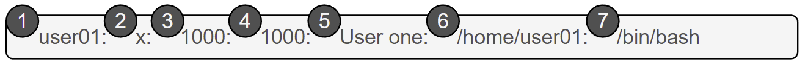
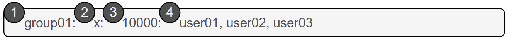

## Цели

После завершения этого раздела вы сможете описать роль пользователей и групп в системе Linux.

## Что такое пользователь?

Учетная запись пользователя применяется для обеспечения безопасных границ между разными людьми и программами, которые могут выполнять команды.

У пользователей есть имена, по которым их можно идентифицировать для удобства работы. Внутри система различает учетные записи пользователей по уникальному идентификационному номеру ― идентификатору пользователя (User ID, *UID*). Если с учетной записью пользователя работают люди, ей обычно назначается секретный пароль, позволяющий пользователю доказать, что он является авторизованным пользователем, при входе в систему.

Учетные записи пользователей имеют основополагающее значение для безопасности системы. Каждый процесс (запущенная программа) в системе работает в контексте определенного пользователя. У каждого файла есть пользователь, который является его владельцем. Владение файлами помогает системе контролировать доступ пользователей к файлам. Файлы и каталоги, доступные запущенному процессу, зависят от пользователя, связанного с этим процессом.

Есть три основных типа пользовательских учетных записей: привилегированный пользователь, системные пользователи и обычные пользователи:

* Учетная запись привилегированного пользователя предназначена для администрирования системы. Имя привилегированного пользователя — *root*, UID учетной записи — 0. У привилегированного пользователя есть полный доступ к системе.
* В системе есть учетные записи системных пользователей, которые используются процессами, предоставляющими вспомогательные службы. Эти процессы (демоны), как правило, не нужно запускать от имени привилегированного пользователя. Им назначаются непривилегированные учетные записи, которые позволяют им защитить файлы и другие ресурсы друг от друга и от обычных пользователей в системе. Пользователи не могут в интерактивном режиме войти в систему под учетной записью системного пользователя.
* У большинства пользователей есть учетная запись обычного пользователя для выполнения повседневных задач. Как и системные пользователи, обычные пользователи имеют ограниченный доступ к системе.

Используйте команду `id` для отображения информации о текущем пользователе, вошедшем в систему.

```
[user01@host ~]$ id
uid=1000(user01) gid=1000(user01) groups=1000(user01) context=unconfined_u:unconfined_r:unconfined_t:s0-s0:c0.c1023
```

Чтобы просмотреть основную информацию о другом пользователе, передайте имя пользователя в команду `id` в качестве аргумента.

```
[user01@host]$ id user02
uid=1002(user02) gid=1001(user02) groups=1001(user02) context=unconfined_u:unconfined_r:unconfined_t:s0-s0:c0.c1023
```

Для просмотра владельца файла используйте команду `ls -l`. Для просмотра владельца каталога используйте команду `ls -ld`. В следующем выводе имя пользователя отображается в третьем столбце.

```
[user01@host ~]$ ls -l file1
-rw-rw-r--. 1 user01 user01 0 Feb  5 11:10 file1
[user01@host]$ ls -ld dir1
drwxrwxr-x. 2 user01 user01 6 Feb  5 11:10 dir1
```

Для просмотра информации о процессе используйте команду `ps`. По умолчанию отображаются только процессы в текущей командной оболочке. Добавьте опцию `a` для просмотра всех процессов на терминале. Для просмотра пользователя, связанного с процессом, добавьте опцию `u`. В следующем выводе имя пользователя отображается в первом столбце.

```
[user01@host]$ ps -au
USER       PID %CPU %MEM    VSZ   RSS TTY      STAT START   TIME COMMAND
root       777  0.0  0.0 225752  1496 tty1     Ss+  11:03   0:00 /sbin/agetty -o -p -- \u --noclear tty1 linux
root       780  0.0  0.1 225392  2064 ttyS0    Ss+  11:03   0:00 /sbin/agetty -o -p -- \u --keep-baud 115200,38400,9600
user01      1207  0.0  0.2 234044  5104 pts/0    Ss   11:09   0:00 -bash
user01      1319  0.0  0.2 266904  3876 pts/0    R+   11:33   0:00 ps au
```

В выводе предыдущих команд пользователи отображаются по имени, однако внутри операционной системы пользователи идентифицируются по UID. Сопоставление имен пользователей с UID определяется в базах данных учетных записей. По умолчанию системы используют файл **/etc/passwd** для хранения информации о локальных пользователях.

Каждая строка в файле **/etc/passwd** содержит информацию об одном пользователе. Она разделена двоеточиями на семь полей. Вот пример строки из файла **/etc/passwd**:



|   поле  | Описание    |
| --- | --- |
| 1   | Имя этого пользователя (user01). |
| 2   | Пароль пользователя раньше хранился здесь в зашифрованном виде. Он был перенесен в файл /etc/shadow, который будет рассмотрен позже. Это поле всегда должно иметь значение x. |
| 3   | Номер UID этой учетной записи пользователя (1000). |
| 4   | Номер GID основной группы для этой учетной записи пользователя (1000). Группы рассматриваются позже в этом разделе. |
| 5   | Настоящее имя этого пользователя (User One). |
| 6   | Домашний каталог этого пользователя (/home/user01). Это начальный рабочий каталог при запуске оболочки, который содержит пользовательские данные и параметры конфигурации. |
| 7   | Программа оболочки по умолчанию для этого пользователя, которая запускается при входе в систему (**/****bin****/****bash**). Для обычного пользователя это программа, предоставляющая командную строку. Системный пользователь может использовать команду **/****sbin****/****nologin**, если интерактивный вход в систему для него не разрешен. |

## Что такое группа?

Группа — это набор пользователей, которым необходим общий доступ к файлам и другим системным ресурсам. Группа позволяет предоставить доступ к файлам нескольким пользователям, а не только одному пользователю.

Как и у пользователей, у групп есть имена для упрощения работы с ними. Внутри система различает группы по уникальному идентификационному номеру ― идентификатору группы (*GID*).

Сопоставление имен групп с GID определяется в базах данных учетных записей групп. По умолчанию системы используют файл **/etc/group** для хранения информации о локальных группах.

Каждая строка в файле **/etc/group** содержит информацию об одной группе. Каждая запись группы разделена двоеточиями на четыре поля. Вот пример строки из файла **/etc/group**:



|  Поле   | Описание    |
| --- | --- |
| 1   | Имя этой группы (group01). |
| 2   | Устаревшее поле пароля группы. Это поле всегда должно иметь значение x. |
| 3   | Номер GID этой группы (10000). |
| 4   | Список участников этой группы, для которых она является дополнительной (user01, user02, user03). Основные группы (по умолчанию) и дополнительные группы рассматриваются далее в этом разделе. |

### Основные и дополнительные группы

Каждый пользователь входит только в одну основную группу. Для локальных пользователей это группа, указанная по номеру GID в файле **/etc/passwd**. По умолчанию это группа, которой будут принадлежать новые файлы, созданные пользователем.

Как правило, при создании нового обычного пользователя создается новая группа с тем же именем, что и у этого пользователя. Она служит основной группой для нового пользователя, который является единственным участником этой частной группы пользователя. Это помогает упростить управление правами доступа к файлам, что будет обсуждаться позже в этом курсе.

У пользователей также могут быть дополнительные группы. Участие в дополнительных группах определяется файлом **/etc/group**. Пользователям предоставляется доступ к файлам в зависимости от того, есть ли доступ у групп, к которым они принадлежат. Не имеет значения, является группа с доступом основной или дополнительной.

Например, если у пользователя *user01* есть основная группа *user01* и дополнительные группы *wheel* и *webadmin*, этот пользователь может читать файлы, доступные для чтения любой из этих трех групп.

С помощью команды `id` можно получить сведения о группах пользователя.

```
[user03@host ~]$ id
uid=1003(user03) gid=1003(user03) groups=1003(user03),10(wheel),10000(group01) context=unconfined_u:unconfined_r:unconfined_t:s0-s0:c0.c1023
```

В предыдущем примере основная группа (**gid**) пользователя *user03* ― *user03*. В элементе **groups** указаны все группы для этого пользователя. Помимо основной группы *user03*, у пользователя есть дополнительные группы *wheel* и *group01*.