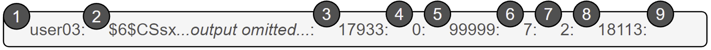
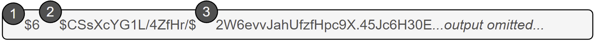
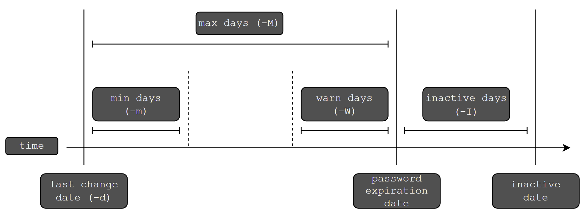

## Цели

После завершения этого раздела вы сможете настроить политику управления паролями для пользователей, а также вручную заблокировать и разблокировать учетные записи пользователей.

## «Теневые» пароли и политика паролей

Когда-то зашифрованные пароли хранились в файле **/etc/passwd**, который мог прочитать любой пользователь. Такой подход считался безопасным, пока не стали распространены атаки с подбором паролей. Тогда зашифрованные пароли были перемещены в отдельный файл **/etc/shadow**, доступный для чтения только учетной записи *root*. Этот новый файл позволял реализовать функции ограничения срока действия паролей.

Как и в случае файла **/etc/passwd**, у каждого пользователя есть строка в файле **/etc/shadow**. Ниже приведен пример строки из файла **/etc/shadow** с девятью полями, разделенными двоеточием.



|  Поле   | Описание    |
| --- | --- |
| 1   | Имя пользователя учетной записи, которой принадлежит этот пароль. |
| 2   | _Зашифрованный_ _пароль_ пользователя. Формат зашифрованных паролей рассматривается позже в этом разделе. |
| 3   | День последнего изменения пароля. Он задается в днях с 01.01.1970 и рассчитывается в часовом поясе UTC. |
| 4   | Минимальное количество дней, которое должно пройти с момента последнего изменения пароля, прежде чем пользователь сможет изменить его снова. |
| 5   | Максимальное количество дней, которое может пройти без смены пароля до окончания срока его действия. Пустое поле означает, что срок действия не заканчивается и не зависит от времени последнего изменения. |
| 6   | Период предупреждения. Пользователь будет предупрежден об окончании срока действия пароля при входе в систему за это количество дней до окончания срока. |
| 7   | Период бездействия. После окончания срока действия пароля он все еще будет приниматься для входа в систему в течение этого количества дней. По окончании этого периода учетная запись будет заблокирована. |
| 8   | День, когда заканчивается срок действия учетной записи. Он задается в днях с 01.01.1970 и рассчитывается в часовом поясе UTC. Пустое поле означает, что срок действия не заканчивается в определенную дату. |
| 9   | Последнее поле обычно пустое и зарезервировано для будущего использования. |

### Формат зашифрованного пароля

В поле зашифрованного пароля содержатся три элемента информации: используемый алгоритм хеширования, модификатор (соль) и зашифрованный хеш. Каждая часть информации отделяется знаком `$`.



|  Поле   | Описание    |
| --- | --- |
| 1   | Алгоритм хеширования, используемый для этого пароля. Число 6 указывает, что это хеш SHA-512, который по умолчанию используется в Red Hat Enterprise Linux 8. Значение 1 означает MD5, а 5 — SHA-256. |
| 2   | Модификатор (соль), используемый для шифрования пароля. Изначально он выбирался случайным образом. |
| 3   | Зашифрованный хеш пароля пользователя. «Соль» и незашифрованный пароль объединяются и шифруются для получения этого зашифрованного хеша пароля. |

Основная причина объединения «соли» с паролем — защита от атак с использованием предварительно рассчитанных списков хешей паролей. Добавление «соли» изменяет результирующие хеши и делает предварительно рассчитанный список бесполезным. Если злоумышленник сможет получить копию файла **/etc/shadow**, использующего «соль», ему придется взламывать пароль, что потребует больше времени и усилий.

### Проверка пароля

Когда пользователь пытается войти в систему, система ищет запись для пользователя в файле **/etc/shadow**, объединяет «соль» с введенным незашифрованным паролем, а затем шифрует их, используя заданный алгоритм хеширования. Если результат совпадает с зашифрованным хешем, считается, что пользователь ввел правильный пароль. Если результат не совпадает, значит, пользователь ввел неправильный пароль и попытка входа завершится ошибкой. Это позволяет системе определить правильность пароля, не сохраняя этого пароля в форме, подходящей для входа.

## Настройка срока действия пароля

На следующей диаграмме представлены параметры срока действия пароля, которые можно настроить с помощью команды `chage` для реализации политики срока действия паролей.



```
[user01@host ~]$ sudo chage -m 0 -M 90 -W 7 -I 14 user03
```

Предыдущая команда `chage` использует опции `-m`, `-M`, `-W` и `-I` для установки минимального срока действия, максимального срока действия, периода предупреждения и периода неактивности пароля пользователя соответственно.

Команда `chage -d 0 user03` заставляет пользователя *user03* обновить пароль при следующем входе в систему.

Команда `chage -l user03` отображает сведения о сроке действия пароля для пользователя *user03*.

Команда `chage -E 2019-08-05 user03` задает для учетной записи пользователя *user03* срок действия до 2019-08-05 (в формате ГГГГ-ММ-ДД).

<details>
<summary>Примечание</summary>

С помощью команды date можно вычислить дату в будущем. Опция -u сообщает время в формате UTC.

```
[user01@host ~]$ date -d "+45 days" -u
Thu May 23 17:01:20 UTC 2019
```
</details>

Отредактируйте элементы настройки срока действия пароля в файле **/etc/login.defs**, чтобы задать политики срока действия пароля по умолчанию. PASS_MAX_DAYS задает максимальный срок действия пароля по умолчанию. PASS_MIN_DAYS задает минимальный срок действия пароля по умолчанию. PASS_WARN_AGE задает период предупреждения пароля по умолчанию. Любые изменения в политиках срока действия пароля по умолчанию применяются только для новых пользователей. Существующие пользователи будут продолжать использовать старые настройки срока действия пароля, а не новые.

## Ограничение доступа

Используйте команду `chage`, чтобы задать дату окончания действия учетной записи. После наступления этой даты пользователь не сможет интерактивно войти в систему. Команда `usermod` с опцией `-L` может заблокировать учетную запись.

```
[user01@host ~]$ sudo usermod -L user03
[user01@host ~]$ su - user03
Password: redhat
su: Authentication failure
```

Если пользователь увольняется из компании, администратор может заблокировать и отключить его учетную запись одной командой `usermod`. Дата указывается в виде количества дней после 01.01.1970 или в формате ГГГГ-ММ-ДД.

```
[user01@host ~]$ sudo usermod -L -e 2019-10-05 user03
```

Предыдущая команда `usermod` использует опцию `-e`, чтобы задать дату окончания срока действия для данной учетной записи пользователя. Опция `-L` блокирует пароль пользователя.

Блокировка учетной записи не позволяет пользователю войти в систему даже при указании правильного пароля. Это рекомендуемый метод отключения доступа к учетной записи для сотрудника, который покинул компанию. Если же сотрудник вернется, учетную запись можно разблокировать с помощью команды `usermod -U`. Если срок действия учетной записи закончился, не забудьте изменить дату окончания срока действия.

### Оболочка nologin

Оболочка *nologin* выступает в качестве сменной оболочки для учетных записей пользователей, не предназначенных для интерактивного входа в систему. С точки зрения безопасности будет разумно отключить вход в систему для учетной записи, если он ей не требуется. Например, почтовому серверу может потребоваться учетная запись для хранения адреса электронной почты и пароля, чтобы пользователь мог пройти аутентификацию в почтовом клиенте для получения почты. Этому пользователю не требуется напрямую входить в систему.

Распространенное решение в такой ситуации — установить для регистрационной оболочки пользователя значение **/sbin/nologin**. Если пользователь пытается войти в систему напрямую, оболочка nologin закроет подключение.

```
[user01@host ~]$ usermod -s /sbin/nologin user03
[user01@host ~]$ su - user03
Last login: Wed Feb  6 17:03:06 IST 2019 on pts/0
This account is currently not available.
```

<details>
<summary>Важно</summary>

Оболочка nologin предотвращает интерактивное использование системы, но не отключает все разрешения на доступ. Пользователи могут проходить аутентификацию, а также отправлять и получать файлы через приложения, например веб-приложения, программы передачи файлов и почтовые клиенты, если они используют пароль пользователя для аутентификации.
</details>


