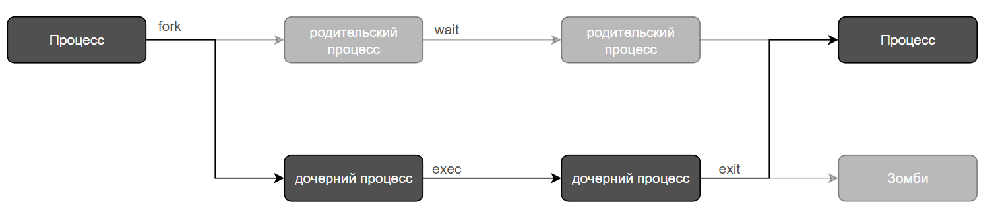

## Цели

После завершения этого раздела вы сможете получить информацию о программах, работающих в системе, для определения их статуса, владельцев и потребления ресурсов, а также управления ими.

## Определение процесса

_Процесс_ — это работающий экземпляр запущенной исполняемой программы. Процесс состоит из следующих элементов:

* адресное пространство выделенной памяти;
    
* свойства безопасности, включая учетные данные и права владельца;
    
* один или несколько потоков выполнения программного кода;
    
* состояние процесса.
    

В _среду_ процесса входят следующие элементы:

* локальные и глобальные переменные;
    
* текущий контекст планирования;
    
* выделенные системные ресурсы, например файловые дескрипторы и сетевые порты.
    

Существующий (_родительский_) процесс дублирует собственное адресное пространство (**fork**), чтобы создать новую (_дочернюю_) структуру процесса. Каждому новому процессу присваивается уникальный _идентификатор процесса_ (**PID**) для отслеживания и защиты. PID и _идентификатор родительского процесса_ (**PPID**) являются элементами среды нового процесса. Любой процесс может создать дочерний процесс. Все процессы являются потомками первого системного процесса (в современных дистрибутивах на базе Red Hat Enterprise Linux и Debian это **systemd**).



С помощью процедуры _ветвления_ (fork) дочерний процесс наследует параметры безопасности, предыдущие и текущие файловые дескрипторы, права для портов и ресурсов, переменные среды и программный код. Дочерний процесс может затем _выполнить_ (exec) собственный программный код. Как правило, родительский процесс находится в _состоянии сна_, пока выполняется дочерний процесс, установив запрос (_wait_) на получение сигнала, когда дочерний процесс завершит работу. При завершении работы дочерний процесс закрывает или освобождает свои ресурсы и среду. Оставшийся ресурс называется _зомби_ и представляет собой запись в таблице процессов. Родительский процесс, получивший сигнал выхода из состояния сна, когда дочерний процесс завершил работу, удаляет запись дочернего процесса из таблицы процессов, освобождая тем самым последний ресурс дочернего процесса. Затем родительский процесс продолжает выполнение своего программного кода.

## Описание состояний процессов

В многозадачной операционной системе каждый ЦП (или ядро ЦП) может работать с одним процессом в конкретный момент времени. По мере выполнения процесса его непосредственные потребности в отношении процессорного времени и выделения ресурсов изменяются. Процессам назначается _состояние_, которое изменяется согласно обстоятельствам.


Состояния процессов Linux показаны на предыдущей диаграмме и описаны в следующей таблице.

**Состояния процессов Linux**

| Имя | Бит | Имя состояния, заданное ядром, и описание |
| --- | --- | --- |
| Running (Запущен) | R   | TASK_RUNNING. Процесс либо выполняется на ЦП, либо ожидает запуска. Процесс может выполнять пользовательские процедуры и процедуры ядра (системные вызовы) или помещаться в очередь и быть готовым при переходе в состояние _Запущен_ (или _Может_ _быть_ _запущен_). |
| Sleeping (В состоянии сна) | S   | TASK_INTERRUPTIBLE. Процесс ждет некоторого условия: аппаратного запроса, доступа к ресурсам системы или сигнала. Когда событие или сигнал удовлетворяет условию, процесс возвращается в состояние _Запущен_. |
| | D   | TASK_UNINTERRUPTIBLE. Этот процесс также находится _в_ _состоянии_ _сна_, но, в отличие от состояния S, он не реагирует на сигналы. Это состояние используется, только если прерывание процесса может привести к непредсказуемому состоянию устройства. |
| | K   | TASK_KILLABLE. Это состояние аналогично непрерываемому состоянию D, но позволяет ожидающему заданию реагировать на сигнал завершения (полное прерывание процесса). Служебные программы часто отображают _завершаемые_ процессы как состояние D. |
| | I   | TASK_REPORT_IDLE. Разновидность состояния D. Ядро не учитывает эти процессы при расчете средней нагрузки. Используется для потоков ядра. Биты TASK_UNINTERRUPTABLE и TASK_NOLOAD установлены. Аналогично состоянию TASK_KILLABLE, которое также является разновидностью состояния D. Принимает критические сигналы. |
| Stopped (Остановлен) | T   | TASK_STOPPED. Процесс был _остановлен_ (приостановлен), обычно по сигналу от пользователя или другого процесса. Этот процесс может быть продолжен (возобновлен) еще одним сигналом, возвращающим в состояние _Запущен_. |
| | T   | TASK_TRACED. Отлаживаемый процесс, который также временно _остановлен_ и использует тот же бит состояния T. |
| Zombie (Зомби) | Z   | EXIT_ZOMBIE. Дочерний процесс отправляет сигнал родительскому процессу при завершении работы. Освобождаются все ресурсы, за исключением идентификатора процесса (PID). |
| | X   | EXIT_DEAD. Когда родительский процесс очищает (_убирает_) оставшуюся структуру дочернего процесса, такой процесс считается полностью высвободившим ресурсы. Это состояние никогда не наблюдается в программах вывода списков процессов. |

### Важность состояний процессов

При диагностике системы важно понимать, как ядро взаимодействует с процессами и как процессы взаимодействуют друг с другом. При создании процесса система присваивает ему состояние. В столбце **S** команды `top` и столбце STAT команды `ps` показано состояние каждого процесса. В системе с одним процессором в каждый момент времени может выполняться только один процесс. Можно увидеть несколько процессов с состоянием **R**. Однако не все они будут работать последовательно, некоторые из них будут в состоянии _ожидания_.

```bash
[user@host ~]$ top
PID USER  PR  NI    VIRT    RES    SHR S  %CPU  %MEM     TIME+ COMMAND
  1 root  20   0  244344  13684   9024 S   0.0   0.7   0:02.46 systemd
  2 root  20   0       0      0      0 S   0.0   0.0   0:00.00 kthreadd
...output omitted... 
[user@host ~]$ ps aux
USER       PID %CPU %MEM    VSZ   RSS TTY      STAT START   TIME COMMAND
...output omitted...
root         2  0.0  0.0      0     0 ?        S    11:57   0:00 [kthreadd]
student   3448  0.0  0.2 266904  3836 pts/0    R+   18:07   0:00 ps aux
...output omitted...
```

Процесс можно приостановить, остановить, возобновить, завершить и прервать с помощью сигналов. Сигналы рассматриваются более подробно позже в этой главе. Сигналы могут использоваться другими процессами, самим ядром или пользователями, вошедшими в систему.

## Отображение списка процессов

Команда `ps` используется для отображения списка текущих процессов. Она может предоставить подробную информацию о процессах, включая следующее:

* идентификатор пользователя (**UID**), который определяет привилегии процесса;
    
* уникальный идентификатор процесса (**PID**);
    
* время ЦП и уже прошедшее реальное время;
    
* объем памяти, зарезервированной процессом в различных местах;
    
* расположение стандартного потока вывода (**stdout**), известное как _управляющий терминал_;
    
* текущее состояние процесса.
    
<details>
<summary>Важно</summary>

Linux-версия `ps` поддерживает три формата опций:

* опции UNIX (POSIX), которые могут быть сгруппированы и которым должен предшествовать дефис;
    
* опции BSD, которые могут быть сгруппированы и с которыми не должен использоваться дефис;
    
* длинные опции GNU, которым предшествуют два дефиса.
    
Например, `ps -aux` — это не то же самое, что `ps aux`.
</details>

Один из самых распространенных наборов опций ― aux — отображает все процессы, в том числе без управляющего терминала. Длинный список (опции lax) предоставляет больше технических подробностей, но может отображаться быстрее, если исключить поиск имени пользователя. В похожем синтаксисе UNIX используются опции -ef для отображения всех процессов.

```bash
[user@host ~]$ ps aux
USER       PID %CPU %MEM    VSZ   RSS TTY      STAT START   TIME COMMAND
root         1  0.1  0.1  51648  7504 ?        Ss   17:45   0:03 /usr/lib/systemd/syst
root         2  0.0  0.0      0     0 ?        S    17:45   0:00 [kthreadd]
root         3  0.0  0.0      0     0 ?        S    17:45   0:00 [ksoftirqd/0]
root         5  0.0  0.0      0     0 ?        S<   17:45   0:00 [kworker/0:0H]
root         7  0.0  0.0      0     0 ?        S    17:45   0:00 [migration/0]
...output omitted...
[user@host ~]$ ps lax
F   UID   PID  PPID PRI  NI    VSZ   RSS WCHAN  STAT TTY     TIME COMMAND
4     0     1     0  20   0  51648  7504 ep_pol Ss   ?       0:03 /usr/lib/systemd/
1     0     2     0  20   0      0     0 kthrea S    ?       0:00 [kthreadd]
1     0     3     2  20   0      0     0 smpboo S    ?       0:00 [ksoftirqd/0]
1     0     5     2   0 -20      0     0 worker S<   ?       0:00 [kworker/0:0H]
1     0     7     2 -100  -      0     0 smpboo S    ?       0:00 [migration/0]
...output omitted...
[user@host ~]$ ps -ef
UID        PID  PPID  C STIME TTY          TIME CMD
root         1     0  0 17:45 ?        00:00:03 /usr/lib/systemd/systemd --switched-ro
root         2     0  0 17:45 ?        00:00:00 [kthreadd]
root         3     2  0 17:45 ?        00:00:00 [ksoftirqd/0]
root         5     2  0 17:45 ?        00:00:00 [kworker/0:0H]
root         7     2  0 17:45 ?        00:00:00 [migration/0]
...output omitted...
```

По умолчанию `ps` без опций выбирает все процессы с тем же _эффективным идентификатором пользователя_ (EUID), что и у текущего пользователя, и связанные с тем же терминалом, где была вызвана команда `ps`.

* Процессы в скобках (обычно вверху списка) ― это запланированные потоки ядра.
    
* Зомби указываются как завершающиеся (**exiting**) или неработающие (**defunct**).
    
* Вывод команды `ps` отображается один раз. Используйте `top` для просмотра процессов в представлении, которое динамически обновляется.
    
* `ps` может отображать вывод в формате дерева, и вы можете просматривать связи между родительским и дочерними процессами.
    

Выходные данные по умолчанию сортируются по идентификационному номеру процесса. На первый взгляд порядок может показаться хронологическим. Однако ядро повторно использует идентификаторы процессов, поэтому порядок менее структурирован, чем кажется. Для сортировки используйте опцию `-O` или `--sort`. Порядок отображения соответствует порядку в таблице системных процессов — строки таблицы используются повторно по мере прекращения работы одних процессов и создания новых. Выходные данные могут отображаться в хронологическом порядке, но это не гарантируется, если только явно не используется опция `-O` или `--sort`.