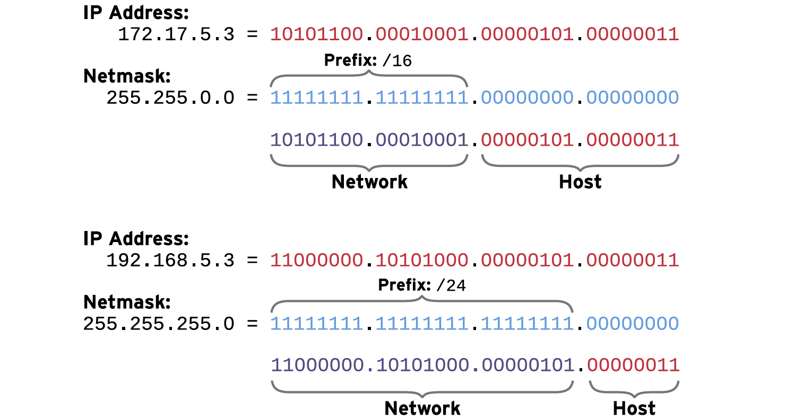
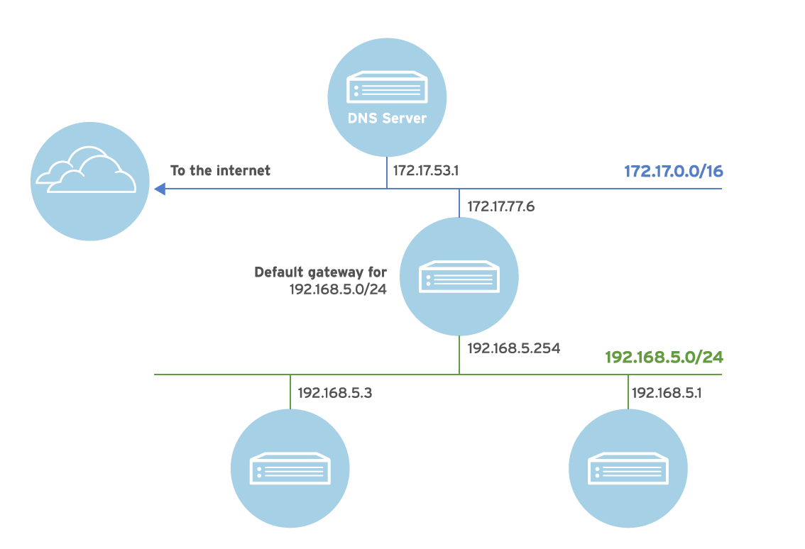
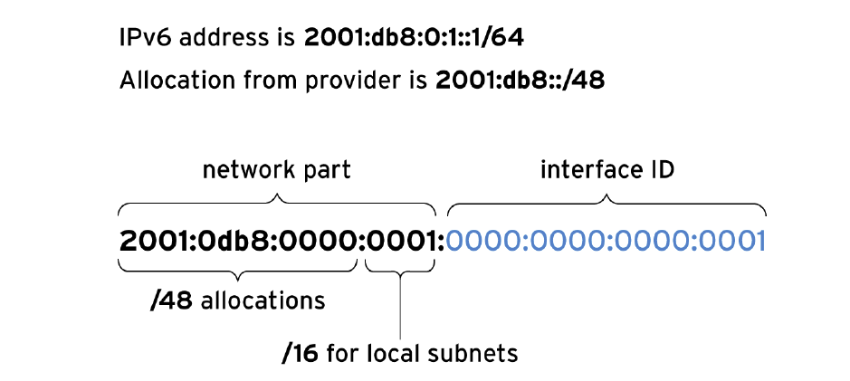

## Цели

После завершения этого раздела вы сможете описать базовые концепции сетевой адресации и маршрутизации для сервера.

## Сетевая модель TCP/IP

Сетевая модель TCP/IP ― это упрощенная, четырехуровневая совокупность абстракций, описывающая взаимодействие различных протоколов для передачи трафика между компьютерами через Интернет. Она описана в документе RFC 1122, Requirements for Internet Hosts -- Communication Layers (Требования к интернет-хостам  — уровни взаимодействия). Рассмотрим эти четыре уровня далее.

### Прикладной уровень

Каждое приложение имеет спецификации по взаимодействию, поэтому клиенты и серверы могут обмениваться информацией в рамках различных платформ. В список общих протоколов входят: SSH (удаленный вход в систему), HTTPS (безопасный веб-протокол), NFS или CIFS (совместное использование файлов) и SMTP (доставка сообщений электронной почты).

### Транспортный уровень

Транспортные протоколы ― это TCP и UDP. Протокол TCP предназначен для надежной передачи информации на основе подключений, а UDP ― это протокол дейтаграмм без установления подключения. Прикладные протоколы используют порты TCP или UDP. Список известных и зарегистрированных портов можно найти в файле /etc/services.
При отправке пакета в сеть комбинация порта службы и IP-адреса формирует сокет. Каждый пакет имеет сокет источника и сокет назначения. Эта информация может использоваться при мониторинге и фильтрации сетевой активности.

### Сетевой уровень

В Интернете (или на сетевом уровне), происходит передача данных от исходного хоста к хосту назначения. IPv4 и IPv6 ― это протоколы сетевого уровня. У каждого хоста есть IP-адрес и префикс, используемый для определения сетевых адресов. Для соединения сетей используются маршрутизаторы.

### Канальный уровень

Канальный уровень, или уровень доступа к среде, обеспечивает подключение к физической среде передачи данных. Наиболее распространенными типами сетей являются проводные сети Ethernet (802.3) и беспроводные сети WLAN (802.11). Каждое физическое устройство имеет аппаратный адрес (MAC), используемый для определения назначения пакетов в локальном сетевом сегменте.

## Описание имен сетевых интерфейсов

У каждого сетевого порта в системе есть имя, которое используется для его настройки и идентификации.

В более ранних версиях Linux для каждого сетевого интерфейса использовались такие имена, как eth0, eth1 и eth2. Имя eth0 присваивалось первому сетевому порту, обнаруженному операционной системой, eth1 ― второму и т. д. Однако по мере добавления и удаления устройств механизм обнаружения и именования устройств мог изменять имена интерфейсов. Более того, стандарт PCIe не гарантирует, что устройства PCIe будут обнаружены в определенном порядке при начальной загрузке, что может приводить к непредвиденному изменению имен устройств во время запуска устройств или системы.

В более новых версиях Linux используется другая система именования. Имена сетевых интерфейсов назначаются на основе информации, полученной от встроенного программного обеспечения, топологии шины PCI и типа сетевого устройства.

Имена сетевых интерфейсов начинаются с типа интерфейса:

* Интерфейсы Ethernet начинаются с en.
* Интерфейсы WLAN начинаются с wl.
* Интерфейсы WWAN начинаются с ww.


Оставшаяся часть имени интерфейса после типа зависит от информации, предоставленной встроенным ПО сервера, или места устройства в топологии PCI.

* `oN` - указывает на то, что это встроенное устройство и что встроенное ПО сервера назначило этому устройству порядковый номер N. Например, `eno1` — это встроенное Ethernet-устройство номер 1. Многие серверы не предоставляют подобную информацию.
* `sN` — это устройство в слоте PCI с горячим подключением номер N. Например, `ens3` — это плата Ethernet в слоте PCI с горячим подключением номер 3.
* `pMsN` — это PCI-устройство на шине M в слоте N. Например, `wlp4s0` — это плата WLAN на PCI-шине 4 в слоте 0. Если плата ― это многофункциональное устройство (например, с платой Ethernet с несколькими портами или устройствами, имеющими функцию Ethernet и другие функции), то к имени устройства будет добавлено `fN`. Например, enp0s1f0 — это функция 0 платы Ethernet на шине 0 в слоте 1. Если есть второй интерфейс с именем enp0s1f1, это функция 1 того же устройства.

Сохранение имен на постоянной основе означает, что имя сетевого интерфейса в системе не изменится в будущем. Недостаток заключается в том, что в системе с одним интерфейсом он не обязательно получит имя eth0.

## Сети IPv4

**IPv4** ― это основной сетевой протокол, используемый в Интернете. Вам необходимо иметь хотя бы базовое представление о сети IPv4, чтобы управлять сетевыми соединениями для ваших серверов.

### IPv4-адреса

**IPv4-адрес** ― это 32-битное число, обычно представляемое в десятичной форме в виде четырех 8-битных октетов со значениями от 0 до 255, разделенных точками. Адрес делится на две части: сетевая часть и хостовая часть. Все хосты в одной подсети, взаимодействующие друг с другом напрямую без участия маршрутизатора, имеют одинаковую сетевую часть; сетевая часть определяет соответствующую подсеть. Никакие два хоста в одной подсети не могут иметь одинаковую хостовую часть; хостовая часть определяет конкретный хост в подсети.

В современном Интернете размер подсети IPv4 является переменной величиной. Чтобы знать, какая часть IPv4-адреса является сетевой, а какая — хостовой, администратор должен знать маску сети, назначенную подсети. Маска сети определяет, сколько битов IPv4-адреса относится к подсети. Чем больше разрядов используется для хостовой части адреса, тем больше хостов может быть в подсети.

Минимально возможный адрес в подсети (вся хостовая часть представляет собой нули в двоичном виде) иногда называется сетевым адресом. Максимально возможный адрес в подсети (вся хостовая часть представляет собой единицы в двоичном виде) используется в IPv4 для рассылки широковещательных сообщений и называется широковещательным адресом.

Для сетевых масок могут использоваться два вида синтаксиса. В более раннем синтаксисе маски сети используются 24 бита для сетевой части. Выглядит он так: 255.255.255.0. Более новый синтаксис, называемый нотацией бесклассовой организации, использует сетевой префикс со значением /24. Оба вида синтаксиса передают одну и ту же информацию, а именно количество ведущих битов в IP-адресе, которые отводятся на сетевой адрес.

Следующие примеры иллюстрируют, каким образом связаны IP-адрес, префикс (маска сети), сетевая часть и хостовая часть.



**Таблица 12.1.1. Определение сетевого адреса для 192.168.1.107/24**

|     |     |     |
| --- | --- | --- |
| Адрес хоста             | 192.168.1.107       | 11000000.10101000.00000001. 01101011 |
| Сетевой префикс         | /24 (255.255.255.0) | 11111111.11111111.11111111. 00000000 |
| Сетевой адрес           | 192.168.1.0         | 11000000.10101000.00000001. 00000000 |
| Широковещательный адрес | 192.168.1.255       | 11000000.10101000.00000001. 11111111 |

**Таблица 12.1.2. Определение сетевого адреса для 10.1.1.18/8**

|     |     |     |
| --- | --- | --- |
| Адрес хоста | 10.1.1.18 | 00001010.00000001.00000001. 00010010 |
| Сетевой префикс | /8 (255.0.0.0) | 11111111.00000000.00000000. 00000000 |
| Сетевой адрес | 10.0.0.0 | 00001010.00000000.00000000. 00000000 |
| Широковещательный адрес | 10.255.255.255 | 00001010.11111111.11111111. 11111111 |

**Таблица 12.1.3. Определение сетевого адреса для 172.16.181.23/19**

|     |     |     |
| --- | --- | --- |
| Адрес хоста | 172.168.181.23 | 10101100.10101000.10110101. 00010111 |
| Сетевой префикс | /19 (255.255.224.0) | 11111111.11111111.11100000. 00000000 |
| Сетевой адрес | 172.168.160.0 | 10101100.10101000.10100000. 00000000 |
| Широковещательный адрес | 172.168.191.255 | 10101100.10101000.10111111. 11111111 |

Специальный адрес 127.0.0.1 всегда указывает на локальную систему («localhost»), а сеть 127.0.0.0/8 принадлежит локальной системе, поэтому может осуществлять взаимодействие сама с собой посредством сетевых протоколов.

### Маршрутизация IPv4

Какой бы протокол ни использовался (IPv4 или IPv6), сетевой трафик должен проходить от хоста к хосту и от сети к сети. Каждый хост имеет таблицу маршрутизации, которая указывает, как направлять трафик для конкретных сетей. Запись таблицы маршрутизации содержит сеть назначения, соответствующий интерфейс для передачи трафика и IP-адрес любого промежуточного маршрутизатора для передачи сообщения к месту назначения. Запись таблицы маршрутизации, соответствующая назначению сетевого трафика, используется для маршрутизации трафика. Если найдены две подходящие записи, используется запись с более длинным префиксом.

Если сетевой трафик не соответствует более конкретному маршруту, таблица маршрутизации обычно использует запись для маршрута по умолчанию для всей сети IPv4: 0.0.0.0/0. Этот маршрут по умолчанию указывает на маршрутизатор в достижимой подсети (то есть подсети, для которой существует более конкретный маршрут в таблице маршрутизации хоста).

Если маршрутизатор получает трафик, адресованный не ему, вместо отбрасывания этого трафика, как это делает обычный хост, он перенаправляет его на основе своей собственной таблицы маршрутизации. При этом трафик может быть отправлен напрямую хосту назначения (если маршрутизатор находится в подсети хоста назначения) или перенаправлен другому маршрутизатору. Процесс перенаправления трафика продолжается до тех пор, пока не будет достигнуто конечное назначение.



**Таблица 12.1.4. Пример таблицы маршрутизации**

| Адрес назначения | Интерфейс | Маршрутизатор (при необходимости) |
| --- | --- | --- |
| 192.0.2.0/24 | wlo1 |     |
| 192.168.5.0/24 | enp3s0 |     |
| 0.0.0.0/0 (_по умолчанию_) | enp3s0 | 192.168.5.254 |

В данном примере трафик, отправляемый на IP-адрес 192.0.2.102 от этого хоста, передается напрямую хосту назначения через беспроводной интерфейс wlo1, так как он наиболее точно соответствует маршруту 192.0.2.0/24. Трафик на IP-адрес 192.168.5.3 передается напрямую хосту назначения через интерфейс Ethernet enp3s0, так как он наиболее точно соответствует маршруту 192.168.5.0/24.

Трафик на IP-адрес 10.2.24.1 передается через интерфейс Ethernet enp3s0 на маршрутизатор с адресом 192.168.5.254, который перенаправляет трафик в конечное назначение. Данный трафик наиболее точно соответствует маршруту 0.0.0.0/0, поскольку для данного хоста не существует более конкретной записи в таблице маршрутизации. Маршрутизатор использует собственную таблицу маршрутизации, чтобы определить, куда перенаправлять трафик.

### Конфигурация IPv4-адреса и маршрута

Сервер может автоматически настраивать параметры сети IPv4 с DHCP-сервера во время начальной загрузки системы. Демон локального клиента запрашивает сетевые параметры у сервера и получает их в аренду на определенный период времени. Если клиент не будет периодически запрашивать продления аренды, он может потерять параметры конфигурации сети.

В качестве альтернативы вы можете настроить сервер на использование статической конфигурации сети. В этом случае сетевые параметры считываются из локальных файлов конфигурации. Вам необходимо получить правильные настройки у сетевого администратора и обновить их вручную, чтобы избежать конфликтов с другими серверами.

## Сети IPv6

Протокол IPv6 предназначен заменить сетевой протокол IPv4. Вам необходимо понять, как он работает, поскольку все больше производственных систем используют IPv6-адресацию. Например, многие поставщики услуг Интернета уже используют IPv6 для внутренних сетей связи и управления устройствами, чтобы выделить все IPv4-адреса для клиентов.

IPv6 также может использоваться параллельно с IPv4 в модели двух стеков. В этой конфигурации у сетевого интерфейса могут быть IPv6-адреса, а также IPv4-адреса. Многие дистрибутивы Linux работают в режиме двух стеков по умолчанию.

### IPv6-адреса

IPv6-адрес — это 128-битное число, обычно записываемое как восемь разделенных двоеточиями групп из четырех шестнадцатеричных полубайтов. Каждый полубайт представляет 4 бита IPv6-адреса, а каждая группа представляет 16 бит IPv6-адреса.

```
2001:0db8:0000:0010:0000:0000:0000:0001
```

Чтобы упростить написание IPv6-адресов, начальные нули в разделенных двоеточиями группах не ставятся. Однако в каждой разделенной двоеточием группе должны быть по крайней мере одна шестнадцатеричная цифра.

```
2001:db8:0:10:0:0:0:1
```

Так как адреса с длинными последовательностями нулей встречаются часто, одну или несколько последовательных групп нулей можно объединить ровно с одним блоком `::`.

```
2001:db8:0:10::1
```

В соответствии с этими правилами еще одним, но менее удобным способом записи адреса будет 2001:db8::0010:0:0:0:1. Это допустимое представление того же адреса, что может сбить с толку администраторов, незнакомых с IPv6. Далее приведены некоторые советы по записи понятных адресов:

* Не используйте начальные нули в группе.
* Используйте `::`, чтобы максимально сократить адрес.
* Если адрес содержит две последовательные группы нулей, равные по длине, рекомендуется сокращать крайние левые группы нулей до `::` и крайние правые группы до `:0:` для каждой группы.
* Хотя это и разрешено, не используйте `::` для сокращения одной группы нулей. Вместо этого используйте `:0:`, а `::` оставьте для последовательных групп нулей.
* Всегда используйте символы нижнего регистра для шестнадцатеричных чисел `a–f`.

<details>
<summary>Важно</summary>

При добавлении сетевого порта TCP или UDP после IPv6-адреса всегда заключайте адрес в квадратные скобки, чтобы порт не выглядел как часть адреса.

```
[2001:db8:0:10::1]:80
```
</details>

### Подсеть IPv6

Обычный IPv6-адрес одноадресной рассылки разделен на две части: сетевой префикс и идентификатор интерфейса. Сетевой префикс идентифицирует подсеть. Интерфейсы в одной подсети не могут иметь одинаковые идентификаторы. Идентификатор интерфейса определяет конкретный интерфейс в подсети.

В отличие от IPv4 протокол IPv6 имеет стандартную маску подсети, которая применяется почти для всех обычных адресов, ― **/64**. В этом случае половина адреса — это сетевой префикс, а другая половина — идентификатор интерфейса. Таким образом, одна подсеть может вмещать любое количество хостов.

Обычно поставщик сетевых услуг выделяет для организации более короткий префикс, например **/48**. Оставшаяся часть сети может использоваться для назначения подсетей (всегда длиной **/64**) из этого выделенного префикса. Для выделенного **/48** это оставит 16 бит для подсетей (до 65536 подсетей).



**Таблица 12.1.5. Часто используемые IPv6-адреса и сети**

| IPv6-адрес или сеть | Назначение | Описание |
|---|---|---|
| ::1/128 | localhost | IPv6-эквивалент адреса 127.0.0.1/8, заданный в кольцевом интерфейсе. |
| ::  | Неуказанный адрес | IPv6-эквивалент адреса 0.0.0.0. Для сетевой службы это может означать, что она прослушивает все настроенные IP-адреса. |
| ::/0 | Маршрут по умолчанию (IPv6-Интернет) | IPv6-эквивалент адреса 0.0.0.0/0. Маршрут по умолчанию в таблице маршрутизации соответствует этой сети. Маршрутизатор для этой сети ― это место, куда отправляется весь трафик, для которого не был найден лучший маршрут. |
| 2000::/3 | Глобальные адреса одноадресной рассылки | «Обычные» IPv6-адреса в настоящее время выделяются организацией IANA из этого пространства. Это эквивалент всех сетей в диапазоне с 2000::/16 по 3fff::/16. |
| fd00::/8 | Уникальные локальные адреса (RFC 4193) | IPv6 не имеет прямого эквивалента пространству частных адресов RFC 1918, но это наиболее близкий к нему вариант. Сайт может использовать эти адреса для самостоятельного выделения пространства частных маршрутизируемых IP-адресов внутри организации, но эти сети не могут использоваться в глобальном Интернете. Сайт должен _случайно_ выбрать /48 в этом пространстве, но он может выделять подсети в сети /64 обычным образом. |
| fe80::/10 | Адреса link-local | Каждый интерфейс IPv6 автоматически настраивает адрес одноадресной рассылки _link-local_, который работает только в локальном канале сети fe80::/64.<br><br>Однако весь диапазон fe80::/10 зарезервирован для использования в будущем локальным каналом. Это будет более подробно описано далее. |
| ff00::/8 | Многоадресная рассылка | IPv6-эквивалент адреса 224.0.0.0/4. Многоадресная рассылка используется для одновременной передачи данных нескольким хостам. Это важная технология для протокола IPv6, так как он не имеет широковещательных адресов. |

<details>
<summary>Важно</summary>

В таблице выше перечислены выделенные сетевые адреса, которые зарезервированы для конкретных целей. Эти выделенные адреса могут принадлежать множеству разных сетей. Помните, что сети IPv6, выделенные из глобальных и локальных пространств одноадресной рассылки, имеют стандартную маску подсети /64.
</details>

Адрес *link-local* в IPv6 — это немаршрутизируемый адрес, используемый только для взаимодействия с хостами по определенному сетевому каналу. Каждый сетевой интерфейс в системе автоматически получает адрес link-local в сети `fe80::/64`. Для обеспечения уникальности идентификатор интерфейса для адреса link-local формируется из аппаратного Ethernet-адреса сетевого интерфейса. Обычный метод преобразования 48-битного MAC-адреса в 64-битный идентификатор интерфейса — инвертировать 7-й бит MAC-адреса и вставить `ff:fe` между двумя средними битами:

* Сетевой префикс: fe80::/64
* MAC-адрес: 00:11:22:aa:bb:cc
* Адрес link-local: fe80::211:22ff:feaa:bbcc/64
* 
Адреса link-local других машин могут использоваться как обычные адреса другими хостами в том же канале. Поскольку в каждом канале есть сеть `fe80::/64`, таблицу маршрутизации нельзя использовать для выбора исходящего интерфейса. Канал, используемый при взаимодействии с адресом link-local, должен быть указан с *идентификатором области* в конце адреса. Идентификатор области состоит из знака `%`, за которым следует имя сетевого интерфейса.

Например, чтобы использовать ping6 для отправки ping-запроса на адрес link-local `fe80::211:22ff:feaa:bbcc`, используя канал, подключенный к сетевому интерфейсу ens3, следует использовать следующий синтаксис:

```
[user@host ~]$ ping6 fe80::211:22ff:feaa:bbcc%ens3
```

<details>
<summary>Примечание</summary>

Идентификаторы области нужны только при обращении к адресам, имеющим область «канал». Обычные глобальные адреса используются таким же образом, как в протоколе IPv4, и исходящие интерфейсы для них выбираются из таблицы маршрутизации.
</details>

Многоадресная рассылка позволяет одной системе отправлять трафик на специальный IP-адрес, который получают несколько систем. Она отличается от широковещательной рассылки тем, что трафик получают только определенные системы в сети. Она также отличается от широковещательной рассылки в IPv4 тем, что часть многоадресного трафика может направляться в другие подсети в зависимости от конфигурации сетевых маршрутизаторов и систем.

Многоадресная рассылка играет большую роль в протоколе IPv6, чем в IPv4, так как в IPv6 нет широковещательного адреса. Ключевой адрес многоадресной рассылки в IPv6 ― `ff02::1` ― это адрес link-local для всех узлов. При отправке ping-запроса на этот адрес трафик отправляется всем узлам канала. Адреса многоадресной рассылки с областью «канал» (начинающиеся с `ff02::/8`) должны быть указаны с идентификатором области, как и адрес link-local.

```
[user@host ~]$ ping6 ff02::1%ens3
PING ff02::1%ens3(ff02::1) 56 data bytes
64 bytes from fe80::211:22ff:feaa:bbcc: icmp_seq=1 ttl=64 time=0.072 ms
64 bytes from fe80::200:aaff:fe33:2211: icmp_seq=1 ttl=64 time=102 ms (DUP!)
64 bytes from fe80::bcd:efff:fea1:b2c3: icmp_seq=1 ttl=64 time=103 ms (DUP!)
64 bytes from fe80::211:22ff:feaa:bbcc: icmp_seq=2 ttl=64 time=0.079 ms
...output omitted...
```

### Конфигурация IPv6-адреса

В IPv4 есть два способа настройки адресов в сетевых интерфейсах. Сетевые адреса для интерфейсов могут быть настроены вручную администратором или динамически из сети через DHCP. IPv6 также поддерживает настройку вручную и два метода динамической настройки, один из них DHCPv6.

Идентификаторы интерфейсов для статических IPv6-адресов можно выбирать по желанию, как и в IPv4. В протоколе IPv4 было два адреса в сети, которые нельзя было использовать: самый младший и самый старший адреса подсети. В IPv6 следующие идентификаторы интерфейсов зарезервированы и не могут использоваться в качестве обычных сетевых адресов хоста.

* Идентификатор, состоящий полностью из нулей `0000:0000:0000:0000` («произвольный адрес маршрутизатора подсети»), используемый всеми маршрутизаторами в канале. (Для сети `2001:db8::/64` это будет адрес `2001:db8::`.)
* Идентификаторы от `fdff:ffff:ffff:ff80` до `fdff:ffff:ffff:ffff`.


DHCPv6 работает немного иначе, чем DHCP для IPv4, в связи с отсутствием широковещательного адреса. По существу, хост отправляет запрос DHCPv6 со своего адреса link-local на порт **547/UDP** в `ff02::1:2` (группу многоадресной рассылки link-local для всех серверов dhcp). Сервер DHCPv6 затем обычно отправляет ответ с соответствующими сведениями на порт **546/UDP** клиентского адреса link-local.

Пакет **dhcp** в Linux обеспечивает поддержку сервера DHCPv6.

Помимо DHCPv6, протокол IPv6 также поддерживает второй метод динамической конфигурации, который называется автоматической настройкой адресов без сохранения состояния (**Stateless Address Autoconfiguration**, SLAAC). С помощью SLAAC хост обычным образом согласует свой интерфейс с адресом link-local `fe80::/64`. Затем он отправляет «запрос маршрутизатора» в `ff02::2` (группу многоадресной рассылки link-local для всех маршрутизаторов). Маршрутизатор IPv6 в локальном канале отвечает на адрес link-local хоста с сетевым префиксом и, возможно, другой информацией. Хост затем использует этот сетевой префикс с идентификатором интерфейса, который обычно формируется таким же образом, как и адреса link-local. Маршрутизатор периодически отправляет обновления многоадресной рассылки («объявления маршрутизатора») для подтверждения или обновления предоставленной информации.

Пакет **radvd** позволяет маршрутизатору IPv6 на основе Linux предоставлять SLAAC через объявления маршрутизатора.

<details>
<summary>Важно</summary>

Типичная машина с ОС Linux, настроенная на получение IPv4-адресов через DHCP, также обычно настроена на использование SLAAC для получения IPv6-адресов. Это может привести к непредвиденному получению машинами IPv6-адресов при добавлении в сеть маршрутизатора IPv6.

Некоторые развертывания IPv6 объединяют SLAAC и DHCPv6, и SLAAC применяется только для предоставления сведений о сетевом адресе, а DHCPv6 ― для предоставления другой информации, например о том, какие DNS-серверы и домены поиска следует настраивать.
</details>

## Имена и IP-адреса хостов

Постоянно использовать IP-адреса для обращения к серверам было бы довольно неудобно. Человеку привычнее работать с именами, чем с длинными и трудными для запоминания строками чисел. Поэтому в Linux есть ряд механизмов для сопоставления имени хоста с IP-адресом. Вместе они называются **разрешением имен**.

Можно настроить статическую запись для каждого имени в файле **/etc/hosts** в каждой системе. Для этого необходимо вручную обновить копию файла на каждом сервере.

Для большинства хостов вы можете найти адрес для имени хоста (или имя хоста для адреса) в сетевой службе, называемой **системой доменных имен** (DNS). DNS ― это распределенная сеть серверов, сопоставляющая имена хостов с IP-адресами. Чтобы служба имен работала, хосту необходимо указать сервер имен. Данный сервер имен не обязательно должен находиться в той же подсети; он всего лишь должен быть достижимым для хоста. Эти настройки можно задать через DHCP или статически в файле **/etc/resolv.conf**. Настройка разрешения имен будет рассматриваться в следующих разделах этой главы.

