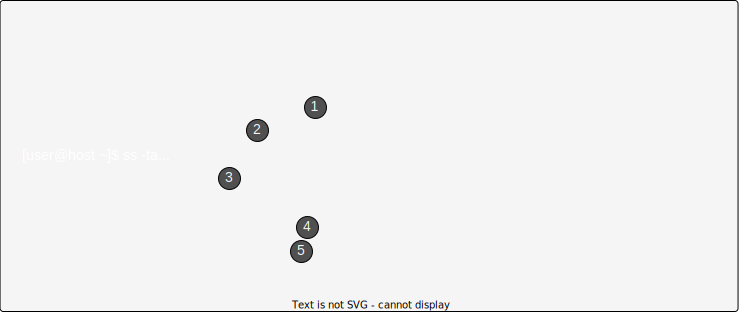

## Цели

После завершения этого раздела вы сможете протестировать и просмотреть текущую конфигурацию сети с помощью утилит командной строки.

## Сбор информации о сетевом интерфейсе

### Идентификация сетевых интерфейсов

Команда `ip link` отображает список всех сетевых интерфейсов в системе.

```bash
[user@host ~]$ ip link show
1: lo: <LOOPBACK,UP,LOWER_UP> mtu 65536 qdisc noqueue state UNKNOWN mode DEFAULT group default qlen 1000
    link/loopback 00:00:00:00:00:00 brd 00:00:00:00:00:00
2: ens3: <BROADCAST,MULTICAST,UP,LOWER_UP> mtu 1500 qdisc mq state UP mode DEFAULT group default qlen 1000
    link/ether 52:54:00:00:00:0a brd ff:ff:ff:ff:ff:ff
3: ens4: <BROADCAST,MULTICAST,UP,LOWER_UP> mtu 1500 qdisc mq state UP mode DEFAULT group default qlen 1000
    link/ether 52:54:00:00:00:1e brd ff:ff:ff:ff:ff:ff
```

В предыдущем примере у сервера три сетевых интерфейса: **lo** (loopback-устройство, подключенное к самому серверу) и два интерфейса Ethernet (**ens3** и **ens4**).

Для правильной настройки каждого сетевого интерфейса необходимо знать, какой из них к какой сети подключен. Во многих случаях вы будете знать MAC-адрес интерфейса, подключенного к каждой сети: либо он физически напечатан на плате или сервере, либо это виртуальная машина и вы знаете, как она настроена. MAC-адрес устройства указан после link/ether каждого интерфейса. Значит, сетевая плата с MAC-адресом `52:54:00:00:00:0a` ― это сетевой интерфейс **ens3**.

### Отображение IP-адресов

Используйте команду ip для просмотра сведений об устройствах и адресах. Один сетевой интерфейс может иметь несколько IPv4- или IPv6-адресов.


|     |     |
| --- | --- |
| 1   | Активный интерфейс включен (UP). |
| 2   | В строке link/ether показан аппаратный адрес (MAC) устройства. |
| 3   | В строке inet показаны IPv4-адрес, длина его сетевого префикса и область действия. |
| 4   | В строке inet6 показаны IPv6-адрес, длина его сетевого префикса и область действия. Этот адрес относится к глобальной (_global_) области действия и используется обычным образом. |
| 5   | Эта строка inet6 показывает, что интерфейс имеет IPv6-адрес с областью действия «канал» (_link_), который можно использовать только для взаимодействия по локальному каналу Ethernet. |


### Отображение статистики о производительности

Команду `ip` также можно использовать для отображения статистики о производительности сети. Счетчики для каждого сетевого интерфейса можно использовать для выявления проблем с сетью. Счетчики записывают статистику по таким параметрам, как количество полученных (**RX**) и переданных (**TX**) пакетов, ошибок пакетов и отброшенных пакетов.

```bash
[user@host ~]$ ip -s link show ens3
2: ens3: <BROADCAST,MULTICAST,UP,LOWER_UP> mtu 1500 qdisc pfifo_fast state UP qlen 1000
link/ether 52:54:00:00:00:0a brd ff:ff:ff:ff:ff:ff
    RX: bytes  packets  errors  dropped overrun mcast
    269850     2931     0       0       0       0
    TX: bytes  packets  errors  dropped carrier collsns
    300556     3250     0       0       0       0
```

## Проверка подключения между хостами

С помощью команды `ping` можно протестировать подключение. Эта команда выполняется до тех пор, пока не будут нажаты клавиши **Ctrl+c**, если не заданы опции для ограничения количества отправляемых пакетов.

```
[user@host ~]$ ping -c3 192.0.2.254
PING 192.0.2.1 (192.0.2.254) 56(84) bytes of data.
64 bytes from 192.0.2.254: icmp_seq=1 ttl=64 time=4.33 ms
64 bytes from 192.0.2.254: icmp_seq=2 ttl=64 time=3.48 ms
64 bytes from 192.0.2.254: icmp_seq=3 ttl=64 time=6.83 ms

--- 192.0.2.254 ping statistics ---
3 packets transmitted, 3 received, 0% packet loss, time 2003ms
rtt min/avg/max/mdev = 3.485/4.885/6.837/1.424 ms
```

Команда `ping6` — это IPv6-версия команды `ping` в Linux. Она взаимодействует по IPv6 и принимает IPv6-адреса, но в остальном действует как `ping`.

```bash
[user@host ~]$ ping6 2001:db8:0:1::1
PING 2001:db8:0:1::1(2001:db8:0:1::1) 56 data bytes
64 bytes from 2001:db8:0:1::1: icmp_seq=1 ttl=64 time=18.4 ms
64 bytes from 2001:db8:0:1::1: icmp_seq=2 ttl=64 time=0.178 ms
64 bytes from 2001:db8:0:1::1: icmp_seq=3 ttl=64 time=0.180 ms
^C
--- 2001:db8:0:1::1 ping statistics ---
3 packets transmitted, 3 received, 0% packet loss, time 2001ms
rtt min/avg/max/mdev = 0.178/6.272/18.458/8.616 ms
[user@host ~]$ 
```

При отправке ping-запроса адресам link-local и группе многоадресной рассылки link-local для всех узлов (`ff02::1`) используемый сетевой интерфейс должен быть явно задан с идентификатором зоны области действия (например, `ff02::1%ens3`). Если не сделать этого, появится ошибка `connect: Invalid argument`.

Отправка ping-запросов на `ff02::1` может быть полезна для поиска других узлов IPv6 в локальной сети.

```bash
[user@host ~]$ ping6 ff02::1%ens4
PING ff02::1%ens4(ff02::1) 56 data bytes
64 bytes from fe80::78cf:7fff:fed2:f97b: icmp_seq=1 ttl=64 time=22.7 ms
64 bytes from fe80::f482:dbff:fe25:6a9f: icmp_seq=1 ttl=64 time=30.1 ms (DUP!)
64 bytes from fe80::78cf:7fff:fed2:f97b: icmp_seq=2 ttl=64 time=0.183 ms
64 bytes from fe80::f482:dbff:fe25:6a9f: icmp_seq=2 ttl=64 time=0.231 ms (DUP!)
^C
--- ff02::1%ens4 ping statistics ---
2 packets transmitted, 2 received, +2 duplicates, 0% packet loss, time 1001ms
rtt min/avg/max/mdev = 0.183/13.320/30.158/13.374 ms
[user@host ~]$ ping6 -c 1 fe80::f482:dbff:fe25:6a9f%ens4
PING fe80::f482:dbff:fe25:6a9f%ens4(fe80::f482:dbff:fe25:6a9f) 56 data bytes
64 bytes from fe80::f482:dbff:fe25:6a9f: icmp_seq=1 ttl=64 time=22.9 ms

--- fe80::f482:dbff:fe25:6a9f%ens4 ping statistics ---
1 packets transmitted, 1 received, 0% packet loss, time 0ms
rtt min/avg/max/mdev = 22.903/22.903/22.903/0.000 ms
```

Помните, что IPv6-адреса link-local могут использоваться другими хостами на том же канале как обычные адреса.

```
[user@host ~]$ ssh fe80::f482:dbff:fe25:6a9f%ens4
user@fe80::f482:dbff:fe25:6a9f%ens4's password:
Last login: Thu Jun  5 15:20:10 2014 from host.example.com
[user@server ~]$ 
```

## Устранение проблем маршрутизации

Сетевая маршрутизация сложна, и с управлением трафиком могут возникнуть проблемы. Вот несколько полезных диагностических средств.

### Отображение таблицы маршрутизации

Используйте команду `ip route` для отображения информации о маршрутизации.

```bash
[user@host ~]$ ip route
default via 192.0.2.254 dev ens3 proto static metric 1024
192.0.2.0/24 dev ens3 proto kernel scope link src 192.0.2.2
10.0.0.0/8 dev ens4 proto kernel scope link src 10.0.0.11
```

Вы видите таблицу маршрутизации IPv4. Все пакеты для сети `10.0.0.0/8` будут передаваться напрямую в пункт назначения через устройство **ens4**. Все пакеты для сети `192.0.2.0/24` будут передаваться напрямую в пункт назначения через устройство **ens3**. Все остальные пакеты будут отправляться на маршрутизатор по умолчанию с IPv4-адресом `192.0.2.254`, а также через устройство **ens3**.

Добавьте опцию `-6`, чтобы отобразить таблицу маршрутизации IPv6.

```bash
[user@host ~]$ ip -6 route
unreachable ::/96 dev lo  metric 1024  error -101
unreachable ::ffff:0.0.0.0/96 dev lo  metric 1024  error -101
2001:db8:0:1::/64 dev ens3  proto kernel  metric 256
unreachable 2002:a00::/24 dev lo  metric 1024  error -101
unreachable 2002:7f00::/24 dev lo  metric 1024  error -101
unreachable 2002:a9fe::/32 dev lo  metric 1024  error -101
unreachable 2002:ac10::/28 dev lo  metric 1024  error -101
unreachable 2002:c0a8::/32 dev lo  metric 1024  error -101
unreachable 2002:e000::/19 dev lo  metric 1024  error -101
unreachable 3ffe:ffff::/32 dev lo  metric 1024  error -101
fe80::/64 dev ens3  proto kernel  metric 256
default via 2001:db8:0:1::ffff dev ens3  proto static  metric 1024
```

В этом примере игнорируйте недоступные маршруты, которые указывают на неиспользуемые сети. Таким образом, остаются три маршрута:

1.	Сеть `2001:db8:0:1::/64` с использованием интерфейса **ens3** (который, предположительно, имеет адрес в этой сети).
2.	Сеть `fe80::/64` с использованием интерфейса **ens3** для адреса link-local. В системе с несколькими интерфейсами существует маршрут к `fe80::/64` из каждого интерфейса для каждого адреса link-local.
3.	Маршрут по умолчанию ко всем сетям в Интернете IPv6 (сеть `::/0`), не имеющим более конкретного маршрута в системе, через маршрутизатор по адресу `2001:db8:0:1::ffff`, доступный с устройства **ens3**.

### Трассировка маршрутов трафика

Для трассировки пути, по которому сетевой трафик проходит до удаленного хоста через несколько маршрутизаторов, используйте команду `traceroute` или `tracepath`. Таким образом, вы сможете определить, связана проблема с одним из ваших маршрутизаторов или с промежуточным. Обе команды по умолчанию используют пакеты UDP для трассировки пути, однако многие сети блокируют трафик UDP и ICMP. У команды `traceroute` есть опции для трассировки пути с помощью пакетов UDP (по умолчанию), ICMP (`-I`) или TCP (`-T`). Однако команда `traceroute`, как правило, по умолчанию не установлена.

```bash
[user@host ~]$ tracepath access.redhat.com
...output omitted...
 4:  71-32-28-145.rcmt.qwest.net                          48.853ms asymm  5
 5:  dcp-brdr-04.inet.qwest.net                          100.732ms asymm  7
 6:  206.111.0.153.ptr.us.xo.net                          96.245ms asymm  7
 7:  207.88.14.162.ptr.us.xo.net                          85.270ms asymm  8
 8:  ae1d0.cir1.atlanta6-ga.us.xo.net                     64.160ms asymm  7
 9:  216.156.108.98.ptr.us.xo.net                        108.652ms
10:  bu-ether13.atlngamq46w-bcr00.tbone.rr.com           107.286ms asymm 12
...output omitted...
```

Каждая строка в выводе команды `tracepath` представляет маршрутизатор или переход, который пакет проходит между источником и назначением. Предоставляется дополнительная информация, включая время на передачу (RTT) и изменения размера максимальной единицы передачи (MTU). Указание asymm означает, что трафик достиг того маршрутизатора и вернулся с него с использованием других (асимметричных) маршрутов. Показанные маршрутизаторы используются для исходящего трафика, а не для обратного.

Команды `tracepath6` и `traceroute -6` эквивалентны командам `tracepath` и `traceroute` для протокола IPv6.

```bash
[user@host ~]$ tracepath6 2001:db8:0:2::451
 1?: [LOCALHOST]                        0.091ms pmtu 1500
 1:  2001:db8:0:1::ba                   0.214ms
 2:  2001:db8:0:1::1                    0.512ms
 3:  2001:db8:0:2::451                  0.559ms reached
     Resume: pmtu 1500 hops 3 back 3
```

## Устранение проблем с портами и службами

Службы TCP используют сокеты как конечные точки для связи и имеют IP-адрес, протокол и номер порта. Службы обычно прослушивают стандартные порты, а клиенты используют произвольный доступный порт. Известные имена стандартных портов указаны в файле **/etc/services**.

Команда `ss` отображает статистику сокета. Команда `ss` предназначена для замены старой утилиты `netstat`, включенной в пакет **net-tools**, которая может быть более знакома некоторым системным администраторам, но не всегда установлена в системе.



|     |     |
| --- | --- |
| 1   | Порт, используемый для SSH, прослушивает все IPv4-адреса. «*» представляет «все» IPv4-адреса или порты. |
| 2   | Порт, используемый для SMTP, прослушивает кольцевой интерфейс IPv4 127.0.0.1. |
| 3   | Установленное SSH-подключение находится на интерфейсе 172.25.250.10 и его источник ― система с адресом 172.25.254.254. |
| 4   | Порт, используемый для SSH, прослушивает все IPv6-адреса. Синтаксис «::» представляет все интерфейсы IPv6. |
| 5   | Порт, используемый для SMTP, прослушивает кольцевой интерфейс IPv6 ::1. |

**Таблица 12.1.6. Опции для ss и netstat**

| Опция | Описание |
| --- | --- |
| -n  | Отображение номеров вместо имен для интерфейсов и портов. |
| -t  | Отображение сокетов TCP. |
| -u  | Отображение сокетов UDP. |
| -l  | Отображение только прослушивающих сокетов. |
| -a  | Отображение всех сокетов (прослушивающих и установленных). |
| -p  | Отображение процесса, использующего сокеты. |
| -A inet | Отображение активных подключений (но не прослушивающих сокетов) для семейства адресов inet. То есть, сокеты локального домена UNIX игнорируются.<br><br>Для `ss` будут отображаться подключения и IPv4, и IPv6. Для `netstat` отображаются только подключения IPv4. (`netstat -A inet6` отображает подключения IPv6, а `netstat -46` ― IPv4 и IPv6.) |
