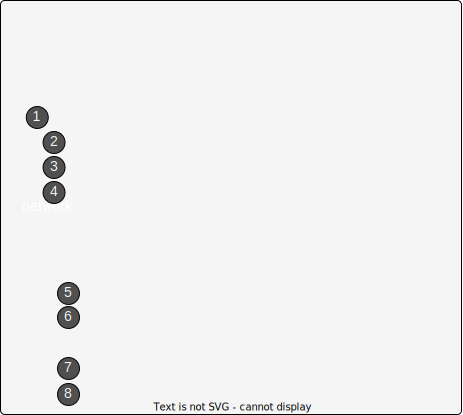

## Цели

После завершения этого раздела вы сможете управлять сетевыми параметрами и устройствами с помощью команды nmcli и утилиты netstat.

## Описание концепций NetworkManager

**NetworkManager** — это демон, который осуществляет мониторинг сетевых параметров и управляет ими. Помимо демона, предусмотрен апплет **GNOME Notification Area**, который предоставляет информацию о состоянии сети. Утилиты командной строки и графические утилиты взаимодействуют с **NetworkManager** и сохраняют файлы конфигурации в каталоге /**etc/sysconfig/network-scripts**.

Важные термины и правила в контексте **NetworkManager**:

* Устройство — это сетевой интерфейс.
* Подключение — это набор параметров, которые можно настроить для устройства.
* Для любого устройства в определенный момент времени может быть активным только одно подключение. Может существовать несколько подключений для использования разными устройствами или для изменения конфигурации одного устройства. Если вам необходимо временно изменить сетевые параметры, то вместо изменения конфигурации подключения можно изменить активное подключение для устройства. Например, устройство для интерфейса беспроводной сети на ноутбуке может использовать разные подключения для беспроводной сети в офисе и для беспроводной сети дома.
* У каждого подключения есть имя или идентификатор.
* Для создания и редактирования файлов подключений из командной строки можно использовать утилиту `nmcli`.


## Просмотр сведений о сети

Команда `nmcli dev status` отображает состояние всех сетевых устройств.

```bash
[user@host ~]$ nmcli dev status
DEVICE  TYPE      STATE         CONNECTION
eno1    ethernet  connected     eno1
ens3    ethernet  connected     static-ens3
eno2    ethernet  disconnected  --
lo      loopback  unmanaged     --
```

Команда `nmcli con show` отображает список всех подключений. Чтобы отобразить только активные подключения, добавьте опцию `--active`.

```bash
[user@host ~]$ nmcli con show
NAME         UUID                                  TYPE            DEVICE
eno2         ff9f7d69-db83-4fed-9f32-939f8b5f81cd  802-3-ethernet  --
static-ens3  72ca57a2-f780-40da-b146-99f71c431e2b  802-3-ethernet  ens3
eno1         87b53c56-1f5d-4a29-a869-8a7bdaf56dfa  802-3-ethernet  eno1
[user@host ~]$ nmcli con show --active
NAME         UUID                                  TYPE            DEVICE
static-ens3  72ca57a2-f780-40da-b146-99f71c431e2b  802-3-ethernet  ens3
eno1         87b53c56-1f5d-4a29-a869-8a7bdaf56dfa  802-3-ethernet  eno1
```

## Добавление сетевого подключения

Для добавления новых сетевых подключений используется команда `nmcli con add`. В приведенных ниже примерах команд `nmcli con add` предполагается, что имя добавляемого сетевого подключения еще не используется.

Следующая команда добавляет новое подключение с именем **eno2** для интерфейса **eno2**, которое получает сведения о сети IPv4 через DHCP и подключается автоматически при запуске. Оно также получает сетевые параметры IPv6, прослушивая объявления маршрутизатора по локальному каналу. Имя файла конфигурации основано на значении опции `con-name` ( eno2) и сохраняется в файле **/etc/sysconfig/network-scripts/ifcfg-eno2**.

```bash
[root@host ~]# nmcli con add con-name eno2 type ethernet ifname eno2
```

В следующем примере создается подключение **eno2** для устройства **eno2** со статическим IPv4-адресом, используя IPv4-адрес с сетевым префиксом `192.168.0.5/24` и шлюзом по умолчанию `192.168.0.254`. Подключение по-прежнему устанавливается автоматически при запуске, и конфигурация сохраняется в том же файле. В связи с ограничениями размера экрана завершите первую строку символом экранирования оболочки (`\`) и продолжите команду на следующей строке.

```bash
[root@host ~]# nmcli con add con-name eno2 type ethernet ifname eno2 \
ipv4.address 192.168.0.5/24 ipv4.gateway 192.168.0.254
```

В последнем примере создается подключение **eno2** для устройства **eno2** со статическими IPv6- и IPv4-адресами, используя IPv6-адрес с сетевым префиксом `2001:db8:0:1::c000:207/64` и шлюзом IPv6 по умолчанию `2001:db8:0:1::1` и IPv4-адрес с сетевым префиксом `192.0.2.7/24` и шлюзом IPv4 по умолчанию `192.0.2.1`. Подключение по-прежнему осуществляется автоматически при запуске, а конфигурация сохраняется в файле **/etc/sysconfig/network-scripts/ifcfg-eno2**. В связи с ограничениями размера экрана завершите первую строку символом экранирования оболочки (`\`) и продолжите команду на следующей строке.

```bash
[root@host ~]# nmcli con add con-name eno2 type ethernet ifname eno2 \
ipv6.address 2001:db8:0:1::c000:207/64 ipv6.gateway 2001:db8:0:1::1 \
ipv4.address 192.0.2.7/24 ipv4.gateway 192.0.2.1
```

## Управление сетевыми подключениями

Команда `nmcli con up <name>` активирует подключение `name` для сетевого интерфейса, к которому оно привязано. Обратите внимание, что команда принимает имя подключения, а не имя сетевого интерфейса. Помните, что команда n`mcli con show` отображает имена всех доступных подключений.

```bash
[root@host ~]# nmcli con up static-ens3
```

Команда `nmcli dev disconnect <device>` отсоединяет сетевой интерфейс `device` и выключает его. Эту команду можно сокращенно записать как `nmcli dev dis <device>`:

```
[root@host ~]# nmcli dev dis ens3
```

<details>
<summary>Важно</summary>

Используйте команду `nmcli dev dis <device>` для деактивации сетевого интерфейса.

Команда `nmcli con down <name>` ― не самый лучший вариант для деактивации сетевого интерфейса, поскольку она выключает подключение. Однако по умолчанию для большинства проводных системных подключений настроена опция **autoconnect**. Она активирует подключение, как только сетевой интерфейс становится доступным. Поскольку сетевой интерфейс подключения все еще доступен, команда `nmcli con down <name>` выключает сетевой интерфейс, но затем **NetworkManager** сразу же включает его снова, если подключение не было полностью отсоединено от интерфейса.
</details>

## Изменение параметров сетевого подключения

У подключений **NetworkManager** есть два типа параметров. Есть статические параметры подключения, которые настраиваются администратором и хранятся в файлах конфигурации в **/etc/sysconfig/network-scripts/ifcfg-\***. Также могут присутствовать активные параметры подключения, которые подключение получает с сервера DHCP и которые не хранятся постоянно.
Чтобы отобразить список текущих параметров подключения, выполните команду `nmcli con show <name>`, где `name` — это имя подключения. Параметры в нижнем регистре ― это статические свойства, которые администратор может изменить. Параметры в верхнем регистре — это активные параметры, временно используемые этим экземпляром подключения.

```bash
[root@host ~]# nmcli con show static-ens3
connection.id:                          static-ens3
connection.uuid:                        87b53c56-1f5d-4a29-a869-8a7bdaf56dfa
connection.interface-name:              --
connection.type:                        802-3-ethernet
connection.autoconnect:                 yes
connection.timestamp:                   1401803453
connection.read-only:                   no
connection.permissions:
connection.zone:                        --
connection.master:                      --
connection.slave-type:                  --
connection.secondaries:
connection.gateway-ping-timeout:        0
802-3-ethernet.port:                    --
802-3-ethernet.speed:                   0
802-3-ethernet.duplex:                  --
802-3-ethernet.auto-negotiate:          yes
802-3-ethernet.mac-address:             CA:9D:E9:2A:CE:F0
802-3-ethernet.cloned-mac-address:      --
802-3-ethernet.mac-address-blacklist:
802-3-ethernet.mtu:                     auto
802-3-ethernet.s390-subchannels:
802-3-ethernet.s390-nettype:            --
802-3-ethernet.s390-options:
ipv4.method:                            manual
ipv4.dns:                               192.168.0.254
ipv4.dns-search:                        example.com
ipv4.addresses:                         { ip = 192.168.0.2/24, gw = 192.168.0.254 }
ipv4.routes:
ipv4.ignore-auto-routes:                no
ipv4.ignore-auto-dns:                   no
ipv4.dhcp-client-id:                    --
ipv4.dhcp-send-hostname:                yes
ipv4.dhcp-hostname:                     --
ipv4.never-default:                     no
ipv4.may-fail:                          yes
ipv6.method:                            manual
ipv6.dns:                               2001:4860:4860::8888
ipv6.dns-search:                        example.com
ipv6.addresses:                         { ip = 2001:db8:0:1::7/64, gw = 2001:db8:0:1::1 }
ipv6.routes:
ipv6.ignore-auto-routes:                no
ipv6.ignore-auto-dns:                   no
ipv6.never-default:                     no
ipv6.may-fail:                          yes
ipv6.ip6-privacy:                       -1 (unknown)
ipv6.dhcp-hostname:                     --
...output omitted...
```

Для изменения параметров подключения используется команда `nmcli con mod <name>`. Эти изменения также сохраняются в файле **/etc/sysconfig/network-scripts/ifcfg-<name>** подключения. Доступные параметры описаны на man-странице `nm-settings(5)`.

Чтобы задать IPv4-адрес `192.0.2.2/24` и шлюз по умолчанию `192.0.2.254` для подключения **static-ens3**, выполните следующую команду:

```bash
[root@host ~]# nmcli con mod static-ens3 ipv4.address 192.0.2.2/24 \
ipv4.gateway 192.0.2.254
```

Чтобы задать IPv6-адрес `2001:db8:0:1::a00:1/64` и шлюз по умолчанию `2001:db8:0:1::1` для подключения **static-ens3**, выполните следующую команду:

```bash
[root@host ~]# nmcli con mod static-ens3 ipv6.address 2001:db8:0:1::a00:1/64 \
ipv6.gateway 2001:db8:0:1::1
```

<details>
<summary>Важно</summary>

Если подключение, получающее параметры IPv4 с сервера DHCPv4, было изменено для получения сведений только из файлов статической конфигурации, параметр **ipv4.method** также следует изменить с `auto` на `manual`.

Аналогичным образом, если подключение, получающее параметры IPv6 с помощью SLAAC или сервера DHCPv6, было изменено для получения сведений только из файлов статической конфигурации, параметр **ipv6.method** также следует изменить с `auto` или `dhcp` на `manual`.

В противном случае подключение может зависнуть или не установиться при активации либо получить IPv4-адрес от DHCP или IPv6-адрес от SLAAC или DHCPv6 в дополнение к статическому адресу.
</details>

Некоторые параметры могут принимать несколько значений. Чтобы добавить определенное значение в список значений параметра или удалить его из списка, добавьте символ `+` или `-` в начало имени параметра.

## Удаление сетевого подключения

Команда `nmcli con del <name>` удаляет подключение с именем `name` из системы, отсоединяет его от устройства и удаляет файл **/etc/sysconfig/network-scripts/ifcfg-<name>**.

```bash
[root@host ~]# nmcli con del static-ens3
```

## Кто может из менять настройки сети?

Пользователь *root* может вносить любые изменения в конфигурацию сети с помощью команды `nmcli`.

Однако обычные пользователи, вошедшие на локальную консоль, также могут вносить различные изменения в сетевую конфигурацию системы. Для этого им необходимо войти с помощью клавиатуры системы на текстовую виртуальную консоль или в среду графического рабочего стола. Дело в том, что, если пользователь физически присутствует за консолью компьютера, то она, вероятно, используется в качестве рабочей станции или ноутбука, а значит, пользователю может потребоваться настроить, активировать и деактивировать интерфейсы беспроводной или проводной сети. Если же система является сервером в центре обработки данных, то, как правило, единственные пользователи, которые входят локально на саму машину, ― это администраторы.

Обычные пользователи, которые входят в систему через **ssh**, могут изменять сетевые разрешения только от имени пользователя *root*.

Используйте команду `nmcli gen permissions`, чтобы посмотреть свои текущие разрешения.

## Сводка по командам

В следующей таблице приведены ключевые команды nmcli, которые рассматривались в этом разделе.

|Команда |	Назначение |
|--------|-------------|
| `nmcli dev status` |	Отображение состояния всех сетевых интерфейсов в **NetworkManager**. |
| `nmcli con show` | 	Отображение списка всех подключений. |
| `nmcli con show name` |	Отображение текущих параметров для подключения `name`. |
| `nmcli con add con-name name` |	Добавление нового подключения с именем `name`. |
| `nmcli con mod name` |	Изменение подключения `name`. |
| `nmcli con reload` |	Перезагрузка файлов конфигурации (полезно, если файлы были отредактированы вручную). |
| `nmcli con up name` |	Активация подключения `name`. |
| `nmcli dev dis dev` |	Деактивация и отсоединение текущего подключения сетевого интерфейса `dev`. |
| `nmcli con del name` |	Удаление подключения `name` и его файла конфигурации. |

## Описание концепции Netplan

**Netplan** — это средство визуализации абстракций конфигурации сети.

Это утилита для настройки сети в системе Linux. Вы создаете описание необходимых интерфейсов и определяете, что каждый из них должен делать.

Netplan удовлетворяет потребность в простой описательной конфигурации сети в формате **YAML** для универсального набора серверных, настольных, облачных или IoT-установок.

Это полезно для администраторов системы Linux, которые хотят использовать единую конфигурацию сети, независимо от используемого бэкенда, такого как NetworkManager или systemd-networkd.


Netplan заменил старый файл конфигурации **/etc/network/interfaces**, который использовался для настройки сетевых интерфейсов в Ubuntu и других дистрибутивах Linux.

### Общая структура файла конфигурации

Узел верхнего уровня называется `network` и содержит следующие определения:

* `version: 2` - текущая версия сетевой конфигурации (обычно используется **2**)
* `renderer: ` - демон управляющий сетевой конфигурацией. На данный момент поддерживаются **NetworkManager** и **networkd**
* Определения устройств, сгруппированные по типу, например `ethernets:`, `wifi:`, `bridges`

Каждый блок типа содержит определения устройств с необходимой конфигурацией.



| блок | Описание |
|:------:|----------|
| 1 | Идентификатор конфигурации. В простом случае можно использовать имя устройства, определённое с помощью `ip link show` |
| 2 | Включение/отключение конфигураци dhcpv4. Если значение `true` на интерфейсе будет происходить попытка получения конфигурации по DHCPv4. По умолчанию (если ключ не указан) - `false` |
| 3 | Включение/отключение конфигураци dhcpv6. Если значение `true` на интерфейсе будет происходить попытка получения конфигурации по DHCPv6. По умолчанию (если ключ не указан) - `false` |
| 4 | Блок определения статических адресов; адреса (как IPv4, так и IPv6) задаются в CIDR нотации, т.е. `address/prefixlen` |
| 5 | Ключ блока `nameservers` (содержит параметры DNS), который позволяет задать список поисковых доменов. |
| 6 | Список IPv4 и/или IPv6 адресов DNS-серверов. Все адреса перечисляются через запятую |
| 7 | Ключ блока `routes` (позволяет настроить статические маршруты), в котором указывается сеть назначения. Значение `default` указывает на то, что это запись для маршрута по умолчанию |
| 8 | Адрес шлюза, через который необходимо отправлять пакеты для достижения сети назначения, указанной в элементе **(7)** |


### Настройка статической IPv4 конфигурации с помощью Netplan

В следующем примере интерфейс ens192 настраивается со статическим IPv4-адресом `192.168.10.15/24`, шлюзом по умолчанию - `192.168.10.1` и адресами DNS: `8.8.8.8` и `8.8.4.4`

От имени *root* создайте или отредактируйте существующий YAML файл в /etc/netplan

```
network:
  version: 2
  renderer: NetworkManager
  ethernets:
    ens192:
      dhcp4: false
      addresses:
        - 192.168.10.15/24
      nameservers:
        addresses: [8.8.8.8,8.8.4.4]
      routes:
        - to: default
          via: 192.168.10.1
```

Для проверки конфигурации и её применения в случае правильности используйте используйте команду `netplan try` или `netplan apply`. Разница между командами в том, что `try` ожидает от пользователя подтверждения применения конфигурации, а `apply` применяет её безусловно. В любом случае команду необходимо выполнять от имени *root*

```bash
[root@host ~]# netplan apply
```

### Настройка динамической IPv4 конфигурации с помощью Netplan

В следующем примере интерфейс ens192 настраивается на получение IPv4 конфигурации от DHCPv4 сервера

От имени *root* создайте или отредактируйте существующий YAML файл в /etc/netplan

```
network:
  version: 2
  renderer: NetworkManager
  ethernets:
    ens192:
      dhcp4: true
```

Для проверки конфигурации и её применения в случае правильности используйте используйте команду `netplan try` или `netplan apply`.

```bash
[root@host ~]# netplan apply
```

