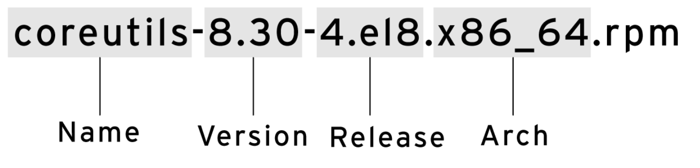

## Цели

После завершения этого разделы вы сможете описать, как программное обеспечение предоставляется в виде пакетов RPM, а также изучить пакеты, установленные в системе с помощью Yum и RPM.

## Программные пакеты и RPM

Программа **RPM Package Manager**, разработанная компанией Red Hat, ― это стандартный способ распространения программных пакетов. Управлять программным обеспечением в виде пакетов RPM намного проще, чем работать с программным обеспечением, которое просто было извлечено в файловую систему из архива. Администраторы могут отслеживать, какие файлы были установлены программным пакетом, какие должны быть удалены, если пакет удаляется, а также проверять наличие вспомогательных пакетов при установке пакета. Информация об установленных пакетах хранится в локальной базе данных RPM в каждой системе. Все программное обеспечение, предоставляемое компанией Red Hat для Red Hat Enterprise Linux, представлено в виде пакетов RPM.

Имена файлов RPM-пакетов состоят из четырех элементов (и суффикса .rpm): **name-version-release.architecture**.



* **NAME** — это одно или несколько слов, описывающих содержимое пакета (coreutils).
* **VERSION** — это номер версии исходного программного обеспечения (8.30).
* **RELEASE** — это номер релиза пакета, основанный на версии; он устанавливается сборщиком пакета, который может и не быть разработчиком исходного программного обеспечения (4.el8).
* **ARCH** — это архитектура процессора, для которой пакет был скомпилирован. noarch указывает, что содержимое пакета не зависит от архитектуры (в отличие от x86_64 для 64-разрядных систем, aarch64 для 64-разрядных систем ARM и т. д.).
* 
Для установки пакетов из репозиториев требуется только имя пакета. Если существует несколько версий, устанавливается пакет с более высоким номером версии. Если существует несколько релизов одной версии, устанавливается пакет с более высоким номером релиза.

Каждый пакет RPM ― это особый архив, состоящий из трех компонентов:

* файлы, устанавливаемые пакетом;
* информация о пакете (метаданные), такая как имя, версия, релиз, архитектура, сводка и описание пакета, требует ли он установки других пакетов, лицензии, список изменений пакета и другие сведения;
* сценарии, которые могут выполняться, когда устанавливается, обновляется или удаляется пакет, либо запускаются, когда устанавливаются, обновляются или удаляются другие пакеты.


Как правило, поставщики программного обеспечения подписывают пакеты RPM с помощью ключей GPG. (Red Hat подписывает цифровой подписью все выпускаемые пакеты.) Система RPM проверяет целостность пакета, подтверждая, что пакет был подписан соответствующим ключом GPG. Система RPM не установит пакет, если подпись GPG не совпадает.

### Обновление ПО с помощью пакетов RPM

Red Hat создает полный пакет RPM для обновления программного обеспечения. Администратор, устанавливающий этот пакет, получает только самую последнюю версию пакета. Red Hat не требует установки и исправления старых пакетов. Для обновления программного обеспечения система RPM удаляет старую версию пакета и устанавливает новую. Обновления обычно сохраняют файлы конфигурации, но точное поведение определяет сборщик новой версии.

В большинстве случаев можно установить только одну версию или релиз пакета. Однако, если пакет собран таким образом, что в нем нет конфликтующих имен файлов, можно установить несколько версий. В качестве примера можно привести пакет kernel. Поскольку новое ядро может быть протестировано только после его загрузки, соответствующий пакет специально собирается таким образом, чтобы обеспечить возможность одновременной установки нескольких версий. Если новое ядро не загружается, старое ядро по-прежнему доступно и может быть загружено.

## Просмотр пакетов RPM

`rpm` — это утилита нижнего уровня, которая может получать сведения о содержимом файлов пакетов и установленных пакетах. По умолчанию она получает информацию из локальной базы данных установленных пакетов. Используйте опцию `-p`, чтобы получить информацию о загруженном файле пакета. Так можно проверить содержимое файла пакета перед его установкой.

Стандартная форма запроса:

* `rpm -q [select-options] [query-options]`


**Запросы RPM: общая информация об установленных пакетах**

* `rpm -qa`: получение списка всех установленных пакетов
* `rpm -qf FILENAME`: получение информации о том, в каком пакете находится файл **FILENAME**

    ```bash
    [user@host ~]$ rpm -qf /etc/yum.repos.d
    redhat-release-8.0-0.39.el8.x86_64
    ```

**Запросы RPM: информация об определенных пакетах**

* `rpm -q`: отображение установленной версии пакета

    ```bash
    [user@host ~]$ rpm -q yum
    yum-4.0.9.2-4.el8.noarch
    ```

* `rpm -qi`: отображение подробных сведений о пакете
* `rpm -ql`: отображение списка файлов, устанавливаемых пакетом

    ```bash
    [user@host ~]$ rpm -ql yum
    /etc/yum.conf
    /etc/yum/pluginconf.d
    /etc/yum/protected.d
    /etc/yum/vars
    /usr/bin/yum
    /usr/share/man/man1/yum-aliases.1.gz
    /usr/share/man/man5/yum.conf.5.gz
    /usr/share/man/man8/yum-shell.8.gz
    /usr/share/man/man8/yum.8.gz
    ```

* `rpm -qc`: отображение списка файлов конфигурации, устанавливаемых пакетом

    ```bash
    [user@host ~]$ rpm -qc openssh-clients
    /etc/ssh/ssh_config
    /etc/ssh/ssh_config.d/05-redhat.conf
    ```

* `rpm -qd`: отображение списка файлов документации, устанавливаемых пакетом

    ```bash
    [user@host ~]$ rpm -qd openssh-clients
    /usr/share/man/man1/scp.1.gz
    /usr/share/man/man1/sftp.1.gz
    /usr/share/man/man1/ssh-add.1.gz
    /usr/share/man/man1/ssh-agent.1.gz
    /usr/share/man/man1/ssh-copy-id.1.gz
    /usr/share/man/man1/ssh-keyscan.1.gz
    /usr/share/man/man1/ssh.1.gz
    /usr/share/man/man5/ssh_config.5.gz
    /usr/share/man/man8/ssh-pkcs11-helper.8.gz
    ```

* `rpm -q --scripts`: отображение списка сценариев командной оболочки, которые выполняются до или после установки или удаления пакета

    ```bash
    [user@host ~]$ rpm -q --scripts openssh-server
    preinstall scriptlet (using /bin/sh):
    getent group sshd >/dev/null || groupadd -g 74 -r sshd || :
    getent passwd sshd >/dev/null || \
    useradd -c "Privilege-separated SSH" -u 74 -g sshd \
    -s /sbin/nologin -r -d /var/empty/sshd sshd 2> /dev/null || :
    postinstall scriptlet (using /bin/sh):

    if [ $1 -eq 1 ] ; then 
            # Initial installation 
            /usr/bin/systemctl preset sshd.service sshd.socket >/dev/null 2>&1 || : 
    fi
    preuninstall scriptlet (using /bin/sh):
    if [ $1 -eq 0 ] ; then 
            # Package removal, not upgrade 
            /usr/bin/systemctl --no-reload disable sshd.service sshd.socket > /dev/null 2>&1 || : 
            /usr/bin/systemctl stop sshd.service sshd.socket > /dev/null 2>&1 || : 
    fi
    postuninstall scriptlet (using /bin/sh):

    /usr/bin/systemctl daemon-reload >/dev/null 2>&1 || : 
    if [ $1 -ge 1 ] ; then 
            # Package upgrade, not uninstall 
            /usr/bin/systemctl try-restart sshd.service >/dev/null 2>&1 || : 
    fi
    ```

* `rpm -q --changelog`: отображение списка изменений пакета

    ```bash
    [user@host ~]$ rpm -q --changelog audit
    * Wed Jan 09 2019 Steve Grubb <sgrubb@redhat.com> 3.0-0.10.20180831git0047a6c
    resolves: rhbz#1655270] Message "audit: backlog limit exceeded" reported
    - Fix annobin failure

    * Fri Dec 07 2018 Steve Grubb <sgrubb@redhat.com> 3.0-0.8.20180831git0047a6c
    resolves: rhbz#1639745 - build requires go-toolset-7 which is not available
    resolves: rhbz#1643567 - service auditd stop exits prematurely
    resolves: rhbz#1616428 - Update git snapshot of audit package
    - Remove static libs subpackage
    ...output omitted...
    ```

Запрос локальных файлов пакетов:

```bash
[user@host ~]$ ls -l wonderwidgets-1.0-4.x86_64.rpm
-rw-rw-r--. 1 user user 257 Mar 13 20:06 wonderwidgets-1.0-4.x86_64.rpm
[user@host ~]$ rpm -qlp wonderwidgets-1.0-4.x86_64.rpm
/etc/wonderwidgets.conf
/usr/bin/wonderwidgets
/usr/share/doc/wonderwidgets-1.0
/usr/share/doc/wonderwidgets-1.0/README.txt
```

## Установка пакетов RPM

С помощью команды `rpm` можно установить пакет RPM, загруженный в локальный каталог.

```
[root@host ~]# rpm -ivh wonderwidgets-1.0-4.x86_64.rpm
Verifying...                          ################################# [100%]
Preparing...                          ################################# [100%]
Updating / installing...
   1:wonderwidgets-1.0-4              ################################# [100%]
[root@host ~]# 
```

Однако в следующем разделе этой главы мы рассмотрим более мощную утилиту для управления установками и обновлениями пакетов RPM из командной строки ― `yum`.

<details>
<summary>Предупреждение</summary>

Будьте осторожны, устанавливая пакеты сторонних поставщиков, не только из-за программного обеспечения, которое может быть установлено вместе с ними, но и потому, что пакет RPM может содержать произвольные сценарии, которые могут запускаться от имени пользователя root в рамках процесса установки.
</details>

<details>
<summary>Примечание</summary>

Вы можете извлечь файлы из пакета RPM без установки пакета. Программа `rpm2cpio` передает содержимое пакета RPM специальной утилите архивации (`cpio`), которая может извлечь все файлы или отдельные файлы.

Направьте вывод команды `rpm2cpio PACKAGEFILE.rpm` в `cpio -id`, чтобы извлечь все файлы, хранящиеся в пакете RPM. По мере необходимости создаются деревья подкаталогов относительно текущего рабочего каталога.

```bash
[user@host tmp-extract]$ rpm2cpio wonderwidgets-1.0-4.x86_64.rpm | cpio -id
Чтобы извлечь отдельный файл, укажите путь к нему.
[user@host ~]$ rpm2cpio wonderwidgets-1.0-4.x86_64.rpm | cpio -id "*txt"
11 blocks
[user@host ~]$ ls -l usr/share/doc/wonderwidgets-1.0/
total 4
-rw-r--r--. 1 user user 76 Feb 13 19:27 README.txt
```
</details>

## Сводка по командам запроса RPM

Установленные пакеты можно запросить напрямую командой rpm. Добавьте опцию `-p`, чтобы запросить файл пакета перед установкой.


| Команда | Задача |
| --- | --- |
| **rpm -qa** | Отображение списка всех установленных пакетов RPM |
| **rpm -q NAME** | Отображение версии пакета NAME, установленного в системе |
| **rpm -qi NAME** | Отображение подробных сведений о пакете |
| **rpm -ql NAME** | Отображение списка всех файлов, включенных в пакет |
| **rpm -qc NAME** | Отображение списка файлов конфигурации, включенных в пакет |
| **rpm -qd NAME** | Отображение списка файлов документации, включенных в пакет |
| **rpm -q --changelog NAME** | Отображение краткого описания причины выпуска новой версии пакета |
| **rpm -q --scripts NAME** | Отображение сценариев командной оболочки, запускаемых при установке, обновлении или удалении пакетов |
